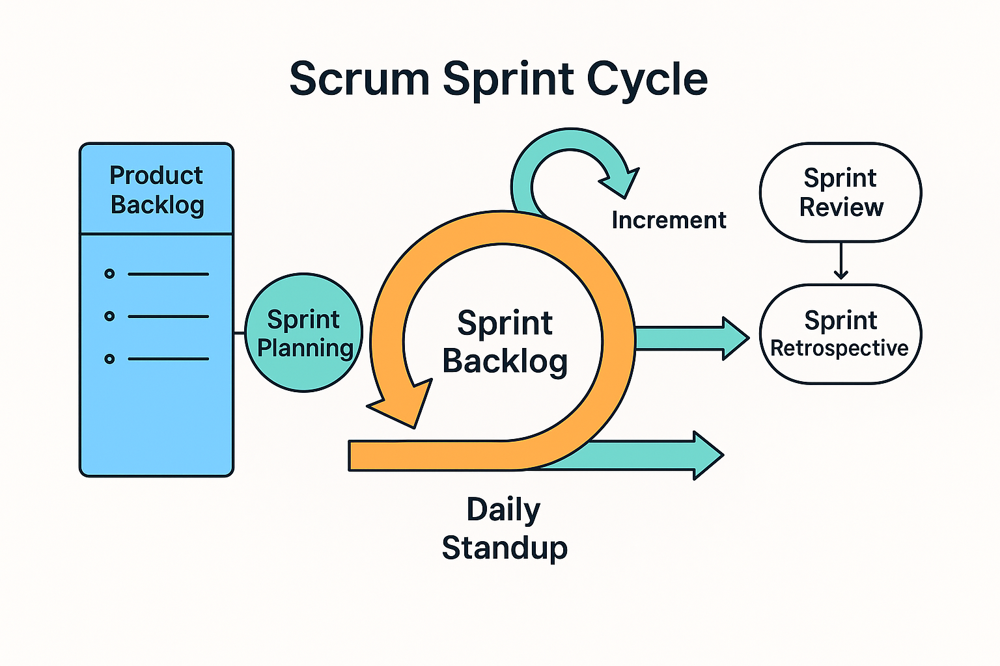

# Практика: приклад Agile-проєкту

## Зміст

1. [Опис прикладу](#опис-прикладу)
2. [Формування Product Backlog](#формування-product-backlog)
3. [Планування спринтів](#планування-спринтів)
4. [Проведення щоденних стендапів](#проведення-щоденних-стендапів)
5. [Робота з відгуками замовника](#робота-з-відгуками-замовника)
6. [Рефлексія та вдосконалення](#рефлексія-та-вдосконалення)
7. [Досягнуті результати](#досягнуті-результати)
8. [Висновок](#висновок)

---

## Опис прикладу

У цьому прикладі розглянуто реалістичний сценарій, як команда працює за методологією Scrum під час розробки мобільного застосунку для управління особистими фінансами. Цей застосунок дозволяє користувачам планувати бюджет, відстежувати витрати та отримувати фінансову аналітику в режимі реального часу.

Команда складається з продуктовго власника, scrum-мастера, п’яти розробників, UX-дизайнера, тестувальника та архітектора. Ключові зацікавлені сторони — фінансові консультанти, які надають зворотний зв’язок щодо функціональності.

---

## Формування Product Backlog

Робота над проєктом починається зі створення **Product Backlog** — списку вимог та ідей щодо функцій застосунку. Продуктовий власник збирає вимоги від потенційних користувачів і замовника, аналізує ринок та визначає найважливіші функції. Наприклад:

- Реєстрація та вхід користувача.
- Інтеграція з банківськими рахунками.
- Автоматична категоризація витрат.
- Створення та редагування бюджетів.
- Аналітика витрат і фінансові звіти.
- Push-сповіщення про перевищення бюджету.

Backlog постійно актуалізується на основі змін ринку та фідбеку користувачів.

---

## Планування спринтів

Загальна розробка поділена на **спринти** тривалістю 2 тижні. На старті кожного спринту команда проводить **Sprint Planning** — зустріч, де обираються найпріоритетніші задачі з Product Backlog і створюється **Sprint Backlog**.

Наприклад, у першому спринті команда вирішує реалізувати базову автентифікацію користувачів та простий інтерфейс додавання витрат.

---

## Проведення щоденних стендапів

Протягом спринту команда проводить **щоденні стендапи** (Daily Stand-up), які тривають не більше 15 хвилин. Кожен учасник відповідає на три питання:

1. Що я зробив учора?
2. Що планую робити сьогодні?
3. Які перешкоди заважають роботі?

Наприклад, розробник повідомляє про проблему з інтеграцією банківських API — scrum-мастер бере це до уваги та допомагає залучити технічного експерта.

---

## Робота з відгуками замовника

Після завершення спринту команда організовує **Sprint Review**, де демонструє замовнику реалізовану частину застосунку. Замовник тестує функціонал та надає відгуки, наприклад:

- Додати двофакторну аутентифікацію.
- Змінити UX головного екрану для спрощення навігації.
- Додати більше аналітичних віджетів.

Ці коментарі потрапляють до Product Backlog і враховуються при плануванні наступних спринтів.

---

## Рефлексія та вдосконалення

Після демонстрації команда проводить **ретроспективу спринту** (Sprint Retrospective). На ретроспективі команда обговорює:

- Що спрацювало добре (наприклад, швидка інтеграція з Firebase для автентифікації).
- Що можна покращити (наприклад, потрібно чіткіше фіксувати acceptance criteria).
- Які дії вжити, щоб уникнути аналогічних проблем у наступному спринті.

Ретроспектива допомагає команді постійно вдосконалювати процеси та робочий підхід.

---

## Досягнуті результати

Завдяки регулярним ітераціям та залученню замовника команда вже за перші два місяці розробила мінімально життєздатну версію застосунку (MVP). Застосунок протестовано на фокус-групі, отримано позитивні відгуки та визначено функції, які потрібно допрацювати для наступних релізів.

---

## Висновок

Цей приклад демонструє, як застосування Scrum допомагає команді:

- Чітко планувати роботу.
- Швидко адаптувати продукт до змін вимог.
- Підтримувати високу якість розробки.
- Підтримувати прозору комунікацію в команді та із замовником.

Завдяки такому підходу команда впевнено рухається до створення продукту, що відповідає потребам ринку та користувачів.
