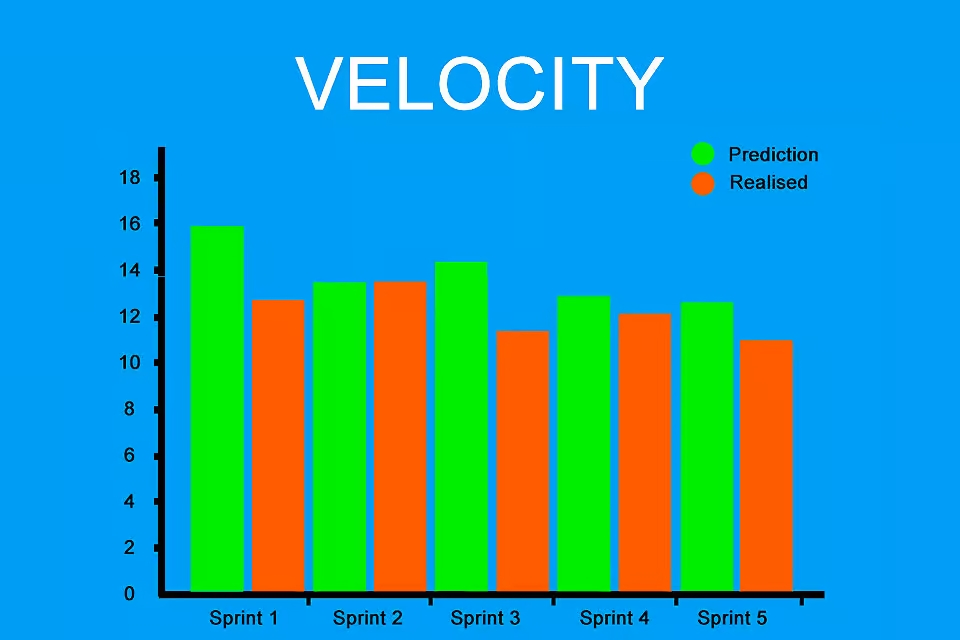

# Agile-планування

Agile-планування — це підхід до організації роботи, який спирається на гнучкість, адаптивність і постійне уточнення пріоритетів. На відміну від традиційного планування, яке передбачає жорстке дотримання фіксованих термінів і обсягів, Agile дозволяє командам працювати ітеративно, швидко адаптуватися до змін, отримувати зворотний зв’язок і поступово вдосконалювати продукт. У цьому документі розглянуто ключові рівні планування, практики оцінювання, інструменти прогнозування, а також приклади використання гнучкого планування на практиці.

---

## Зміст

- [Що таке Agile-планування](#що-таке-agile-планування)
- [Оцінювання складності: Story Points](#оцінювання-складності-story-points)
- [Velocity: вимірювання швидкості команди](#velocity-вимірювання-швидкості-команди)
- [Планування спринтів (Sprint Planning)](#планування-спринтів-sprint-planning)
- [Планування релізів (Release Planning)](#планування-релізів-release-planning)
- [Product Roadmap: створення дорожньої карти](#product-roadmap-створення-дорожньої-карти)
- [Рівні Agile-планування (Agile Planning Onion)](#рівні-agile-планування-agile-planning-onion)
- [Висновок](#висновок)

---

## Що таке Agile-планування?

Agile-планування — це ітеративний підхід до управління проєктами, який відрізняється від традиційного детального планування з фіксованими строками та обсягом робіт. На відміну від класичного підходу, наприклад Gantt-діаграм, де весь проєкт розбивається на чіткі фази й завчасно визначається кінцева дата, Agile передбачає поступове планування з можливістю адаптації на кожному етапі.

У центрі Agile-планування — гнучкість, орієнтація на цінність для замовника та готовність реагувати на зміни. Замість фіксованих термінів команда працює з прогнозованими часовими рамками, короткими ітераціями та пріоритетним беклогом.


### Чим відрізняється від класичного планування (наприклад, Gantt)

У Gantt-плані робота описується як послідовність завдань із чіткими датами початку й завершення. У разі змін такі плани важко коригувати без втрати цілісності.

Agile не передбачає фіксованого кінцевого плану. Замість цього — ітеративне планування, що враховує зворотний зв'язок, нові вимоги та швидку доставку частин продукту. План постійно переглядається та оновлюється.

### Чому планування в Agile — не фіксована дата, а гнучкий орієнтир

Усі оцінки в Agile — це прогнози, а не обіцянки. Команди використовують діапазони дат замість точних термінів. Це дозволяє керуватись реалістичними очікуваннями, зменшує тиск і підвищує довіру до команди.

Гнучкий план краще відображає реалії змінних проєктів, де нові вимоги можуть з’явитися у будь-який момент.

### Ролі, які беруть участь у плануванні

- **Product Owner** — відповідає за бачення продукту, формування та пріоритезацію беклогу, встановлює, що є найважливішим для бізнесу.
- **Scrum Master (або Agile Coach)** — допомагає команді дотримуватись принципів Agile, сприяє ефективному процесу планування, усуває перешкоди.
- **Команда розробників** — оцінює складність задач, бере на себе зобов'язання виконати роботу у межах спринту чи ітерації, планує, як саме досягти цілей.

Agile-планування — це спільна робота всіх учасників, де кожен бере участь у прийнятті рішень. Такий підхід дозволяє будувати реалістичні, адаптивні та ефективні плани.

## Оцінювання складності: Story Points

### Що таке Story Point і для чого він потрібен

Story Point — це умовна, безрозмірна одиниця, яка використовується в Agile для оцінювання складності, обсягу роботи або зусиль, необхідних для реалізації певної user story, функції чи задачі. Важливо, що Story Points не вимірюють час безпосередньо, а оцінюють відносну складність завдання порівняно з іншими завданнями у беклозі.


Використання Story Points дозволяє командам більш гнучко і точно планувати ітерації (спринти), оскільки вони враховують не тільки час, а й такі фактори, як:

- Складність технічної реалізації,
- Обсяг роботи,
- Ризики та невизначеність,
- Зусилля, необхідні для тестування та інтеграції.

Завдяки цьому підходу команда зменшує ризик неправильного планування, що часто трапляється при використанні часових оцінок, і може більш реалістично прогнозувати виконання завдань.

### Відносна оцінка замість часової

Основна ідея Story Points — це відносна оцінка. Замість того, щоб сказати, скільки годин чи днів знадобиться на виконання задачі, команда порівнює складність цієї задачі з іншими, вже оціненими. Наприклад, якщо одна user story оцінена в 2 Story Points, а інша — в 8, це означає, що друга задачі вважається приблизно у 4 рази складнішою за першу.

Цей метод уникає проблем з точністю часових оцінок, бо:

- Час виконання задачі залежить від багатьох факторів, які важко передбачити (неочікувані складнощі, відпустки, контекст переключення),
- Відносні оцінки дозволяють краще адаптуватись до змін і уточнень вимог,
- Сприяють більш швидкому узгодженню оцінок у команді, оскільки фокусуються на порівнянні, а не на абсолютних значеннях.


### Як оцінювати: шкала Фібоначчі, T-shirt sizes

Для прискорення і уніфікації оцінювання часто застосовують стандартні шкали, які допомагають відобразити складність і невизначеність завдань.

- **Шкала Фібоначчі**: 1, 2, 3, 5, 8, 13, 21, ... — ця послідовність використовується через те, що вона збільшується нерівномірно, підкреслюючи, що із зростанням розміру завдання зростає і невизначеність оцінки. Така шкала допомагає команді легше розрізняти маленькі, середні і великі задачі, а також не намагатися надто деталізувати великі завдання.


- **T-shirt sizes**: XS, S, M, L, XL — інтуїтивна шкала, де різні розміри футболок відповідають складності. Цей метод більше підходить для швидкої приблизної оцінки, особливо коли команда тільки починає працювати з відносними оцінками.

Обидва підходи дозволяють уніфікувати оцінки і зробити їх зрозумілими для всієї команди, а також зменшити дискусії про точні числа.

### Техніки оцінювання

Існує кілька популярних технік, які допомагають командам ефективно і швидко проводити оцінку Story Points:

- **Planning Poker**  
  Це найпоширеніший метод, який поєднує елементи гри та колективного прийняття рішень. Кожен учасник команди отримує набір карток з числами, що відповідають значенням Story Points. Після ознайомлення з user story всі одночасно показують картки з оцінкою. Якщо оцінки різняться, обговорюють причини, а потім голосують повторно, доки не буде досягнутий консенсус. Цей метод сприяє залученню всієї команди і враховує різні точки зору.

- **Bucket System**  
  Ця техніка підходить для оцінювання великої кількості задач. Учасники розподіляють завдання по "кошиках" з заздалегідь визначеними значеннями Story Points. Таким чином, можна швидко класифікувати задачі за складністю без детального обговорення кожної.

- **Affinity Estimation**  
  Команда спільно групує задачі за рівнем складності, порівнюючи їх між собою, без призначення числових значень на першому етапі. Після групування кожній групі присвоюється відповідне значення Story Points. Цей метод швидкий і підходить для команд, які добре знайомі з беклогом.

Всі ці методики спрямовані на колективне прийняття рішень і покращення точності оцінок за рахунок різноманітності думок та досвіду членів команди.


Використання Story Points у поєднанні з іншими Agile-практиками дозволяє краще управляти очікуваннями замовника, планувати релізи і коригувати пріоритети залежно від реальних можливостей команди.

---

## Velocity: вимірювання швидкості команди

### Як визначити velocity

**Velocity** (швидкість команди) — це показник, який відображає кількість Story Points (або задач), які команда змогла завершити за один спринт. Це один із ключових індикаторів у Scrum та інших Agile-підходах, який дозволяє командам вимірювати власну продуктивність, а також використовувати ці дані для подальшого планування.



Velocity визначається за простою формулою:

> **Velocity = Сума завершених Story Points за один спринт**

Наприклад, якщо за два тижні команда реалізувала 5 задач, оцінених у 3, 5, 2, 8 та 3 Story Points, то velocity спринту буде **21**.

Важливо враховувати лише ті задачі, які були завершені повністю (тобто мають статус “Done” або пройшли Definition of Done). Незавершені задачі не входять у velocity, навіть якщо виконано більшу їх частину.

### Як використовувати velocity для прогнозування

Velocity є основою для **емпіричного прогнозування** — процесу, в якому команда оцінює, скільки роботи зможе виконати в майбутньому, виходячи з фактичних результатів попередніх спринтів.

#### Як це працює:

1. **Середнє значення velocity** обчислюється на основі кількох останніх спринтів (рекомендується брати 3–5).
2. Це середнє значення використовується для оцінки кількості Story Points, яку команда зможе реалізувати в наступних ітераціях.
3. На основі цього можна:
   - Розрахувати приблизну кількість спринтів, необхідну для завершення певного обсягу роботи.
   - Побудувати **burnup/burndown графіки**, що відображають прогрес і залишок задач до завершення проєкту.
   - Прогнозувати **дату релізу** або **розмір MVP**, який буде готовий до певної дати.

**Приклад:**
Якщо команда має середнє velocity 20 Story Points, а в беклозі залишилося 100 оцінених задач, то команда зможе завершити їх приблизно за 5 спринтів.

> Velocity ≠ ефективність команди. Це не KPI, а лише інструмент для планування.

### Приклади з життя команди (з графіками або табличками)

**Приклад таблиці velocity за 5 спринтів:**

| Спринт | Story Points |
|--------|------------------------|
| 1      | 18                     |
| 2      | 22                     |
| 3      | 19                     |
| 4      | 20                     |
| 5      | 21                     |

**Середнє velocity = (18 + 22 + 19 + 20 + 21) / 5 = 20**

**Графік burndown (згоряння задач):**
- Вісь X — дні спринту
- Вісь Y — кількість Story Points, що залишилися
- Лінія ідеального темпу: рівномірне зменшення задач
- Фактична лінія: показує реальний прогрес

Графік допомагає виявити проблеми з продуктивністю, затримки або перевищення обсягу робіт.

### Від чого залежить стабільність velocity

Стабільність velocity означає, що команда зберігає подібний рівень продуктивності з ітерації в ітерацію. Це дозволяє точніше планувати та прогнозувати. Однак, стабільність залежить від багатьох факторів:

- **Склад команди** — зміни в команді (прихід новачків або звільнення досвідчених членів) впливають на швидкість.
- **Розмір спринтів** — різна тривалість спринтів не дозволяє прямо порівнювати velocity.
- **Якість беклогу** — якщо задачі нечітко сформульовані або не мають Definition of Ready, це гальмує виконання.
- **Зовнішні чинники** — відпустки, технічні проблеми, релізи, залежності від інших команд.
- **Недооцінка складності** — якщо команда систематично недооцінює задачі, velocity буде коливатися.
- **Рівень взаємодії** — низька синхронізація в команді зменшує продуктивність.

Тому стабільність velocity — це не лише технічне питання, а й показник командної зрілості, якості планування та внутрішніх процесів.

---

## Планування спринтів (Sprint Planning)

**Планування ітерації** — це ключова подія в більшості Agile-фреймворків, з якої починається кожен цикл роботи. Її мета — визначити, які задачі команда бере в роботу на найближчий період (спринт, ітерацію) і як саме вона їх буде реалізовувати.

### Хто бере участь і як проходить подія

У плануванні спринту обов’язково беруть участь:
- **Scrum Master** — фасилітує процес, слідкує за дотриманням правил.
- **Product Owner** — пояснює цілі спринту, пріоритети, відповідає на питання про задачі.
- **Команда розробки** — оцінює складність завдань, обговорює реалізацію, обирає обсяг роботи.


# Процес планування спринту

1. **Визначення мети спринту (Define Sprint Goals):** Product Owner презентує ключову мету спринту.
2. **Оцінка зусиль (Estimate Effort):** Команда аналізує обсяг роботи на основі попереднього velocity.
3. **Перегляд і коригування (Review and Adjust):** Обговорюються технічні деталі, ризики та залежності.
4. **Визначення завдань (Identify Tasks):** Перегляд верхньої частини Product Backlog для вибору завдань.
5. **Розподіл відповідальностей (Assign Responsibilities):** Завдання розподіляються між членами команди.
6. **Планування спринту в циклі (Sprint Planning in Cycle):** Формується Sprint Backlog із зобов’язаннями команди на спринт.

Це не просто “роздача задач”, а колективне зобов’язання, яке формується на основі реального потенціалу команди.

---

### Як backlog впливає на вибір завдань у спринт

Якість і готовність **Product Backlog** безпосередньо впливають на ефективність планування. Задачі мають бути:

- Пріоритетними (зверху списку),
- Чітко сформульованими (User Stories, Acceptance Criteria),
- Досить зрозумілими технічно (або з відповідями Product Owner),
- **Оціненими** (наприклад, у Story Points),
- Відповідати **Definition of Ready**.

Команда вибирає стільки задач із верхівки беклогу, скільки вона реально може взяти на себе, орієнтуючись на свій velocity та складність завдань.

---

### Як розрахувати, скільки можна взяти в роботу (на основі velocity)

Velocity команди (середня кількість Story Points, виконаних у попередніх спринтах) слугує базовим орієнтиром. Наприклад, якщо за останні 3 спринти команда стабільно виконувала по **20 Story Points**, вона не повинна планувати більше ніж цей обсяг — інакше зросте ризик недовиконання.

Фактори, які варто врахувати:
- Відпустки або відсутність членів команди.
- Зовнішні події, які можуть вплинути на роботу.
- Технічні ризики чи невизначеність.
- Обсяг супровідних робіт (технічний борг, підтримка тощо).

Команда формує Sprint Backlog із набору задач, який, на її думку, реалістично завершити за спринт.

---

### Що таке Definition of Ready (DoR)

**Definition of Ready** — це набір критеріїв, які визначають, чи готова задача для планування й виконання. Інакше кажучи, це “фільтр якості” для задач перед тим, як вони потрапляють у спринт.

Завдання, які не відповідають DoR, **не повинні потрапити у Sprint Backlog**. Це захищає команду від неясних вимог і знижує ризики зриву плану.

**Типові приклади DoR:**
- Є чітко сформульована User Story.
- Вказані критерії прийнятності (Acceptance Criteria).
- Завдання оцінене в Story Points.
- Пріоритет підтверджений Product Owner.
- Усі зовнішні залежності відомі або усунені.

Definition of Ready створюється командою спільно з Product Owner і може адаптуватися з часом, коли зростає зрілість процесу.

Планування спринту — це не просто розподіл задач, а глибокий командний процес, що базується на реалістичних оцінках, чітких вимогах і взаємній згоді. Він задає темп усієї ітерації, дозволяє уникати хаосу й підвищує передбачуваність у роботі.

---

## Планування релізів (Release Planning)

**Планування релізу** — це процес визначення, що саме буде доставлено в рамках певного випуску продукту, коли і як. Це середньостроковий рівень планування, що з’єднує бачення продукту з конкретними результатами і очікуваннями замовника.

### Як визначити обсяг релізу

Обсяг релізу (release scope) зазвичай формується з найважливіших **функціональностей або епіків**, які мають бути реалізовані до певного моменту часу. Він тісно пов’язаний із пріоритетами бізнесу та очікуваннями клієнтів.

Продуктова команда (зазвичай Product Owner разом із зацікавленими сторонами) аналізує:
- найцінніші елементи з беклогу продукту;
- залежності між задачами;
- технічні обмеження;
- ризики.

> Важливо: обсяг може бути **гнучким** — якщо дедлайн критичний, то змінюється наповнення; якщо важливий повний функціонал — змінюється термін.

### Як прогнозувати дату релізу на основі velocity

Після визначення пріоритетного набору задач для релізу команда може оцінити, **скільки часу потрібно на їх реалізацію**, використовуючи **velocity** (швидкість виконання роботи).

**Формула:**
```
кількість Story Points у релізі ÷ середній velocity команди = приблизна кількість ітерацій
```

Наприклад:
 Якщо обсяг релізу складає 80 SP, а середня швидкість команди — 20 SP за ітерацію, то реліз буде готовий приблизно за 4 спринти.

Також можливий зворотний підхід: якщо фіксована дата релізу, можна розрахувати, скільки завдань реально встигнути виконати, і сформувати обсяг відповідно.

### Що таке MVP у контексті планування

**Minimum Viable Product (MVP)** — це найменший можливий набір функціональностей, який дозволяє отримати зворотний зв’язок від користувачів і протестувати бізнес-гіпотези.

Переваги MVP:
- знижує ризики великих інвестицій без гарантії успіху;
- прискорює вихід продукту на ринок (*time to market*);
- дозволяє приймати рішення на основі реальних даних, а не припущень.

 MVP має бути **корисним, працездатним і достатнім**, щоб користувач зміг отримати цінність і дати зворотний зв’язок.

### Як змінюється план при зміні пріоритетів

Гнучкість — одна з основ Agile. У процесі реалізації релізу можуть змінюватись:
- потреби користувачів;
- бізнес-цілі;
- ринкові умови;
- технічна складність завдань.

У таких випадках **план релізу коригується**:
- задачі замінюються іншими більш пріоритетними;
- MVP звужується або змінюється;
- реліз розбивається на кілька менших;
- частина функціональності переноситься в наступні релізи.

В Agile важливо не чіплятись за початковий план, а адаптуватись до змін, зберігаючи прозорість для всіх учасників процесу.

---

## Product Roadmap: створення дорожньої карти

**Product Roadmap** — це візуальне представлення напрямку розвитку продукту, яке описує, які цілі, функціональність або релізи планується реалізувати протягом певного періоду часу. Це не детальний план дій, а стратегічна карта, що допомагає усім учасникам проєкту зрозуміти, куди рухається продукт.


### Визначення та ціль Roadmap

Мета roadmap — показати пріоритети продукту, зафіксувати основні етапи та забезпечити узгодженість між стейкхолдерами. Вона допомагає:

- координувати зусилля команди;
- комунікувати плани з керівництвом і клієнтами;
- визначати, на що зосередити ресурси в першу чергу;
- адаптуватися до змін у середовищі чи вимогах користувачів.

Roadmap підтримує прозорість і орієнтацію на цінність, замість суворого дотримання жорсткого графіку.

### Рівні деталізації: стратегічна та тактична

Існують два основні рівні деталізації roadmap:

- **Стратегічна дорожня карта** — високорівнева, орієнтована на бізнес-цілі, бачення продукту, очікувані результати. Використовується для планування на квартал, півроку, рік.
- **Тактична дорожня карта** — деталізованіша, може містити конкретні функції, спринти, задачі. Підходить для щомісячного або щотижневого планування й керування командами.

Обидва рівні важливі: стратегічна roadmap визначає напрям, а тактична — конкретні дії на короткий період.

### Формати: таблиця, таймлайн, Swimlanes

Дорожні карти можна візуалізувати в різний спосіб:

- **Таблиця (табличний формат)** — простий варіант, де вказані фічі, статуси, терміни та відповідальні.
- **Таймлайн (Timeline)** — хронологічна візуалізація етапів і фіч, зручно для презентацій.
- **Swimlanes** — горизонтальні або вертикальні дорожні карти з поділом за командами, типами задач або цілями, що дозволяє бачити взаємозв’язки.

У сучасних інструментах (наприклад, Jira Roadmaps, Productboard, Aha!) підтримуються всі ці формати.

### Як roadmap адаптується протягом проєкту

Одна з ключових особливостей Agile-дорожньої карти — **гнучкість**. Вона не є статичним документом і регулярно переглядається:

- на основі зворотного зв’язку від користувачів;
- після зміни пріоритетів бізнесу;
- при виявленні технічних або часових обмежень;
- після завершення чергового релізу або спринту.

Актуальна roadmap — це інструмент керування очікуваннями, а не просто план. Успішні команди проводять регулярні сесії перегляду roadmap (наприклад, раз на місяць або квартал), щоб оновити її відповідно до реальності.

Таким чином, product roadmap — це живий, адаптивний інструмент, який підтримує фокус на цінності, прозорості й гнучкому управлінні проєктом.

---

## Рівні Agile-планування (Agile Planning Onion)

Agile-планування не обмежується лише короткостроковими завданнями на рівні команди. Воно охоплює цілий спектр планувальних рівнів — від стратегічного бачення компанії до щоденних дій. Цю структуру зручно уявити як **"Agile Planning Onion"** — цибулину, де кожен шар відповідає певному рівню деталізації та горизонту планування.


### 6 рівнів Agile-планування:

1. **Strategy (Стратегія)**  
   Найзовнішній рівень, який визначає довгострокове бачення, місію та основні цілі організації. Тут приймаються ключові рішення щодо ринків, на яких буде працювати компанія, типів продуктів, які варто створювати, і напрямків інвестицій.

2. **Portfolio (Портфель проєктів)**  
   На цьому рівні вирішується, які продукти або ініціативи підтримуватимуть загальну стратегію. Визначаються пріоритети, розподіл ресурсів між командами або продуктами, оцінюється бізнес-цінність і ризики.

3. **Product (Продуктовий рівень)**  
   Визначаються основні функціональні блоки, релізи та дорожні карти конкретного продукту. Формується backlog високого рівня, з якого в майбутньому виділяються конкретні задачі. Це рівень Product Owner'а, який транслює стратегію в функціональність.

4. **Release (Реліз)**  
   Планується, які функції будуть включені в черговий реліз, і в які строки. Використовується velocity команди та оцінки складності, щоб прогнозувати, коли реліз буде готовий до поставки. Тут також враховується MVP (Minimum Viable Product) і релізи за етапами.

5. **Iteration (Ітерація / Спринт)**  
   Короткострокове планування на 1–4 тижні. Команда вибирає конкретні user stories із backlog'у, планує обсяг роботи на спринт і розбиває задачі. Визначається мета спринту, очікуваний інкремент, розподіляються ролі в команді.

6. **Daily (Щоденне планування)**  
   Щоденні стендапи, де кожен учасник команди відповідає на 3 питання: що зроблено вчора, що буде зроблено сьогодні, і які є блокери. Мета — оперативна синхронізація, виявлення перешкод і адаптація плану дій.

### Взаємозв’язок між рівнями

Agile-планування — це не набір ізольованих практик. Успішні організації забезпечують **узгодженість між рівнями**:

- Стратегія формує цілі для портфеля.
- Портфель впливає на продуктові рішення.
- Продуктові рішення транслюються в релізи.
- Релізи деталізуються через ітерації.
- Ітерації щодня уточнюються через стендапи.

Зміни на будь-якому з рівнів можуть і повинні швидко передаватися вгору або вниз, забезпечуючи гнучкість і адаптацію.

### Чому Agile — це не лише про щоденні стендапи

Часто Agile асоціюється виключно зі щоденними мітингами, але це лише верхівка айсберга. **Agile — це підхід до керування всією організацією**, який охоплює стратегію, портфель ініціатив, продуктовий розвиток і щоденну командну роботу. Ігнорування вищих рівнів призводить до хаосу або втрати зв’язку з бізнес-цілями.

Саме завдяки багаторівневому плануванню Agile дозволяє організаціям рухатись швидко, залишаючись сфокусованими на цінності, стратегічних пріоритетах і потребах користувачів.

---

## Висновок

Agile-планування — це не просто набір інструментів чи окремих мітингів, а системний підхід до організації роботи, який охоплює всі рівні — від стратегічного бачення компанії до щоденних завдань команд. Завдяки таким елементам, як Story Points, velocity, спринт-планування, релізне прогнозування та продуктова roadmap, команди отримують можливість будувати реалістичні плани, які легко адаптуються до змін.

Однією з головних переваг Agile є прозорість та постійна синхронізація між усіма рівнями — Strategy, Portfolio, Product, Release, Iteration та Daily. Такий багаторівневий підхід дозволяє узгодити дії команди з цілями бізнесу, швидко реагувати на нові виклики та покращувати продукт у тісному зв’язку з користувачем.

Agile — це не лише про щоденні стендапи, а про цілісну культуру адаптивного планування, де основною цінністю є швидка доставка корисного функціоналу, з урахуванням зворотного зв’язку та змін середовища. Успішне впровадження Agile-планування дозволяє командам не просто виконувати задачі, а створювати продукти, які дійсно відповідають потребам користувачів і бізнесу.