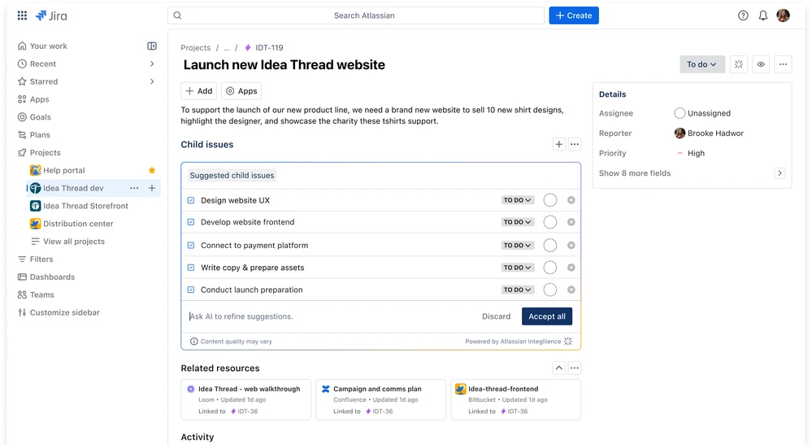
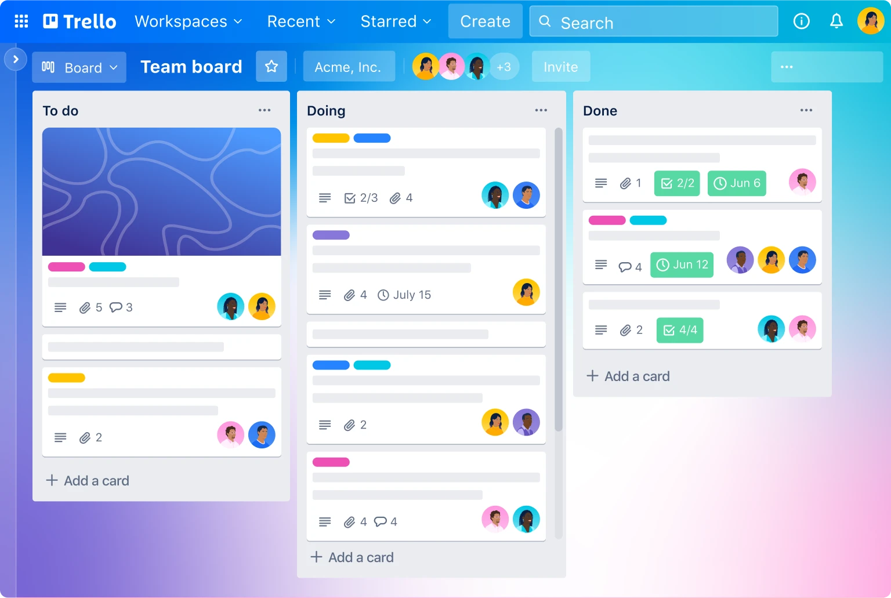
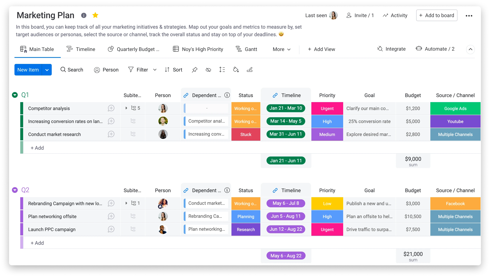
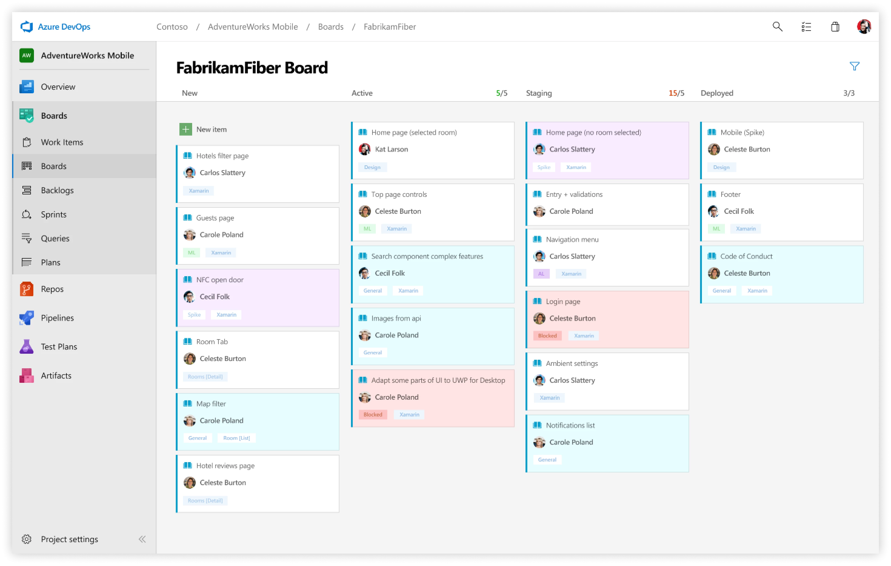

# Agile tools

## Зміст

- [Як обрати інструмент для Agile-команди](#як-обрати-інструмент-для-agile-команди)
- [Jira](#jira)
- [Asana](#asana)
- [Trello](#trello)
- [Monday](#monday)
- [Azure DevOps](#azure-devops)
- [ClickUp](#clickup)

---

## Як обрати інструмент для Agile-команди

Щоб обрати дійсно ефективний інструмент для **Agile-команди**, недостатньо орієнтуватися лише на популярність або рекомендації знайомих. Важливо оцінити **реальні потреби команди**, масштаби проєктів і готовність до впровадження змін у процесах. Правильно підібраний інструмент допомагає оптимізувати роботу, уникнути дублювання завдань і зробити спілкування прозорим.

### Ключові запитання перед вибором інструмента

- Чи відповідає цей інструмент поточному розміру команди і чи буде масштабуватися разом із ростом команди протягом року або більше?
- Які саме функції є критично важливими для команди? Чи потрібні розширені можливості аналітики, автоматизація чи інтеграції з іншими сервісами?
- Чи можна протестувати цей інструмент безкоштовно, щоб оцінити його можливості на практиці?
- Який бюджет команда чи компанія готова витратити на впровадження та підтримку інструмента?
- Чи має інструмент необхідні інтеграції з поширеними сервісами, які вже використовуються командою?
- Чи забезпечує рішення належний рівень безпеки та відповідає політикам ІТ-відділу?

Відповіді на ці запитання допомагають зменшити ризик вибору інструмента, який не виправдає очікувань або швидко перестане відповідати вимогам.

---

## Найпоширеніші інструменти для управління проєктами та завданнями

## Jira

Jira є одним із найвідоміших та найпоширеніших інструментів для управління проєктами. Вона використовується тисячами команд по всьому світу та відома своїми можливостями з відстеження завдань і управління проєктами. Спочатку Jira була спеціально розроблена для команд розробки програмного забезпечення, але також знайшла застосування у інших відділах, зокрема у маркетингових командах.

Завдяки широкому застосуванню в різних командах, Jira відзначається гнучкістю та комплексністю, що дозволяє їй адаптуватися до різноманітних потреб і сценаріїв використання.

Основною перевагою Jira є її комплексний характер, посилений інтеграцією з іншими продуктами Atlassian. Водночас слід зауважити, що повноцінне опанування всіх можливостей інструменту може бути складним завданням, особливо якщо метою є максимальне використання його функціоналу.

### Основні функції Jira

Планування проєктів із використанням Kanban, діаграм Ганта, списків та календарів, відстеження завдань з візуалізацією робочих процесів, управління залежностями та встановлення цілей, інтеграції з сотнями сторонніх інструментів, автоматизація робочих процесів, формування базових та розширених звітів (наприклад, навантаження команди, прогрес спринту), а також вбудовані можливості штучного інтелекту для створення кастомізованих звітів.

### Переваги

- Зручна та зрозуміла навігація, що дозволяє швидко орієнтуватися у великій кількості завдань і проєктів.
- Широкі можливості кастомізації: можна налаштовувати робочі процеси, статуси, типи завдань і шаблони під конкретні потреби команди чи проєкту.
- Високий рівень прозорості — система дає змогу відслідковувати прогрес виконання робіт у реальному часі, що полегшує своєчасне виявлення проблемних зон і усунення перешкод.
- Надійна клієнтська підтримка та активна спільнота користувачів, що допомагають швидко вирішувати технічні або організаційні питання.

### Недоліки

- Існують обмеження щодо дублювання завдань зі статусом «завершено», що іноді ускладнює повторне використання попередніх робочих шаблонів.
- Досить складний процес освоєння для нових користувачів через велику кількість функцій і налаштувань, що може призводити до помилок і потребує додаткового навчання.
- Ліцензійна модель оплати може бути затратною для малих команд, а використання додаткових плагінів часто обмежується кількістю користувачів і потребує додаткових витрат.
- У великих організаціях можливе зниження продуктивності через складну структуру доступу до документів і проєктних матеріалів, що іноді уповільнює роботу команди.

---

## Asana

Asana — це програмний продукт, який дозволяє командам організовувати завдання, проєкти та цілі. Однією з ключових переваг Asana є її простота використання та гнучкість, зокрема завдяки різним варіантам відображення проєктів та можливостям відстеження завдань (залежності, ключові етапи, деталі завдань). Незважаючи на те, що Asana підходить для будь-яких команд, незалежно від методології, її функції з призначення завдань, відстеження строків і прогресу робіт особливо цінуються командами, що працюють за Agile-підходом.

Asana орієнтована на ширшу аудиторію у порівнянні з Jira, зокрема на маркетингові, продуктові та розробницькі команди. Вона підходить як для підприємств будь-якого розміру, так і для індивідуальних користувачів.

### Основні функції Asana

Планування проєктів із використанням Kanban, діаграм Ганта, списків та календарів, застосування шаблонів проєктів, відстеження завдань із візуалізацією робочих процесів, управлінням залежностями та встановленням цілей, понад 100 інтеграцій із сторонніми інструментами, відстеження часу, автоматизація та налаштування робочих процесів, формування базових та розширених звітів (навантаження команди, прогрес спринту тощо), а також вбудовані можливості штучного інтелекту для надання рекомендацій у сфері управління проєктами.

### Переваги

- Дозволяє ефективно організовувати командну роботу над завданнями та проєктами, забезпечуючи прозорість прогресу і своєчасне інформування всіх учасників.
- Має інтуїтивно зрозумілий і зручний інтерфейс, який легко освоїти навіть новим користувачам.
- Дає змогу зручно контролювати хід виконання проєктів через дашборди та звіти, що підвищує ефективність і допомагає оптимізувати витрати часу та ресурсів.

### Недоліки

- Існує ризик пропуску важливих сповіщень через їхнє потрапляння до загальної поштової скриньки.
- Автоматична підписка на електронні повідомлення при створенні нового облікового запису може створювати незручності при налаштуванні сповіщень.
- Обмежена функціональність для роботи з повторюваними завданнями, що ускладнює організацію регулярних або циклічних робочих процесів.

---

## Trello

**Trello** — це популярний інструмент для управління проєктами та завданнями, що побудований на основі візуального методу Kanban. Основна концепція полягає у використанні дощок, списків і карток для організації робочого процесу. Завдяки простому й інтуїтивно зрозумілому інтерфейсу Trello підходить як для індивідуального планування, так і для командної роботи.

Trello входить до екосистеми **Atlassian**, що забезпечує інтеграцію з такими продуктами, як **Jira** та **Confluence**, дозволяючи вибудувати єдиний простір для співпраці.

Простота — головна сильна сторона Trello. Однак саме через це для складних проєктів або великих команд функціоналу може бути недостатньо, якщо потрібні більш глибокі інструменти планування, контролю часу чи обліку ресурсів.

### Ключові можливості

- Управління завданнями у вигляді Kanban-дошок, списків і календарів.
- Використання шаблонів для швидкого старту проєктів.
- Відстеження етапів виконання завдань, постановка цілей і керування залежностями.
- Trello Plan — функція для додавання даних про розташування об’єктів на інтерактивній карті.
- Інтеграції з іншими сервісами.
- Автоматизація робочих процесів і розширення можливостей за допомогою Power-ups.

### Переваги

- Зручність роботи у зрозумілому та візуально привабливому інтерфейсі, що високо оцінюється представниками креативних професій.
- Висока ефективність організації колективної роботи: усі завдання прозоро структуровані, що полегшує контроль і координацію дій команди.
- Простота освоєння та налаштування проєктів із можливістю гнучкої персоналізації карток і робочих процесів відповідно до потреб користувачів.

### Недоліки

- Відсутність окремого застосунка для операційної системи Linux, а також необхідність постійного інтернет-з’єднання для повноцінної роботи.
- Неможливість повного видалення карток і обмеження у вигляді відсутності горизонтальної прокрутки можуть створювати певні незручності.
- Недостатня гнучкість у керуванні складними проєктами зі значною кількістю взаємопов’язаних завдань.
- Імовірність втрати великих обсягів введеної інформації у разі випадкового закриття або згортання застосунка без збереження змін.

---

## Monday

Monday — це гнучкий та налаштовуваний інструмент для управління проєктами та завданнями, розроблений для задоволення різноманітних організаційних потреб, зокрема й для Agile-команд.

Інтерфейс Monday візуально привабливий і легко адаптується під різні типи проєктів та організацій. Окрім сучасного дизайну, платформа пропонує численні інтеграції та автоматизації, які дозволяють зменшити рутину та зосередитися на підвищенні ефективності команди. Також реалізована логіка спільної роботи через можливість роботи з документами безпосередньо в середовищі Monday.

Хоча основна функція Monday — управління проєктами, компанія розвиває додаткові рішення у сферах CRM та розробки, що може здаватися складним на перших етапах освоєння.

Інструмент орієнтований на команди з різних галузей: маркетингу, дизайну, продуктового менеджменту та розробки. Метою Monday є створення універсального і гнучкого рішення, що відповідає потребам широкого спектру користувачів.

### Основні функції Monday

Monday надає широкий набір функцій, серед яких управління та планування проєктів із використанням різних видів подання (Kanban, діаграма Гантта, списки та календар), використання готових шаблонів проєктів, відстеження завдань із візуалізацією робочих процесів, управління залежностями та постановка цілей. Крім того, платформа підтримує інтеграції з іншими сервісами, дозволяє відстежувати час виконання завдань і витрати, здійснювати прогнозування, автоматизувати та налаштовувати робочі процеси, а також формувати базову й розширену звітність щодо завантаженості команди та прогресу спринтів.

### Переваги

- Забезпечує простоту використання завдяки інтуїтивному drag-and-drop інтерфейсу.
- Гнучкість і функціональність, що дозволяють адаптувати інструмент під різні робочі процеси.
- Велика кількість шаблонів для швидкого старту та легкий перехід із інших систем, наприклад, Excel.
- Висока підтримка користувачів і сервісне обслуговування.

### Недоліки

- Іноді інтерфейс може здаватися складним і незручним для відстеження послідовності подій у завданнях.
- Обмежена гнучкість налаштування звітів, через що деякі потрібні метрики або поля неможливо додати.
- Функціонал текстових інформаційних блоків є обмеженим, з малою кількістю опцій для форматування тексту.

---

## Azure DevOps

Azure DevOps — це комплексна платформа від Microsoft для управління повним життєвим циклом розробки програмного забезпечення, яка поєднує інструменти для планування, спільної роботи над кодом, збірки, тестування та розгортання рішень. Вона орієнтована як на великі підприємства, так і на невеликі команди, що працюють за методологіями Agile або DevOps.

Azure DevOps пропонує модульну архітектуру, що дозволяє командам використовувати лише ті сервіси, які їм потрібні. До складу платформи входять такі сервіси: Azure Boards для управління проєктами й завданнями, Azure Repos для спільної роботи з репозиторіями Git, Azure Pipelines для CI/CD, Azure Test Plans для організації тестування та Azure Artifacts для управління пакетами.

Завдяки гнучкості та глибокій інтеграції з іншими сервісами Microsoft, Azure DevOps ідеально підходить для організацій, які працюють із технологічним стеком Microsoft або потребують широких можливостей автоматизації та контролю процесів розробки.

### Основні функції Azure DevOps

Azure DevOps включає набір потужних інструментів: управління завданнями та беклогом через Azure Boards, гнучке планування спринтів і відстеження прогресу; використання репозиторіїв Git із можливістю контролю версій у Azure Repos; автоматизацію збірки, тестування та розгортання за допомогою Azure Pipelines; проведення ручного й автоматизованого тестування через Azure Test Plans; управління пакетами, залежностями та артефактами з Azure Artifacts. Платформа підтримує інтеграції з популярними IDE, хмарними середовищами та сторонніми інструментами.

### Переваги

- Потужна інтеграція з екосистемою Microsoft і популярними інструментами для розробки.
- Гнучке управління завданнями, спринтами й релізами відповідно до принципів Agile та DevOps.
- Можливість масштабування від невеликих команд до великих підприємств.
- Вбудовані засоби для автоматизації CI/CD, управління тестуванням та артефактами.

### Недоліки

- Складність освоєння для користувачів, які не знайомі з екосистемою Microsoft.
- Інтерфейс може бути перевантаженим для невеликих проєктів або команд із простими сценаріями.
- Деякі функції вимагають додаткової оплати або використання преміум-ліцензій.

---

## ClickUp

ClickUp — це багатофункціональна платформа для управління проєктами, завданнями та спільною роботою команд, орієнтована на максимально широку адаптацію під будь-які робочі процеси. ClickUp позиціонує себе як «єдиний робочий простір», який дозволяє централізувати планування, відстеження й комунікацію всередині команди.

Інтерфейс ClickUp досить гнучкий і підтримує глибоку кастомізацію, що дозволяє створювати власні робочі простори, статуси, поля та автоматизації. Платформа об’єднує можливості управління завданнями, створення документів, чату, відстеження цілей, а також інтеграції з великою кількістю сторонніх сервісів.

ClickUp підходить як для невеликих стартапів, так і для масштабних організацій, що працюють за Agile, Scrum чи Kanban. Завдяки високій гнучкості та різноманітним шаблонам, його можна налаштувати під потреби будь-якої галузі: ІТ, маркетинг, дизайн чи адміністративні процеси.

### Основні функції ClickUp

ClickUp підтримує різні типи подання: списки, Kanban-дошки, діаграми Гантта, календарі та мапи розуму. Серед функцій — управління задачами з багаторівневою ієрархією, контроль залежностей, створення шаблонів процесів, відстеження часу, постановка цілей і ключових результатів (OKR). Крім того, доступне створення документації та вікі всередині платформи, комунікація через вбудований чат, автоматизація повторюваних завдань і розширене налаштування ролей та доступу.

### Переваги

- Потужна гнучкість налаштування для різних типів команд і проєктів.
- Великий набір шаблонів і інтеграцій із популярними сервісами.
- Можливість поєднувати управління завданнями, документацію та комунікацію в одному середовищі.
- Високий рівень автоматизації та кастомізації.

### Недоліки

- Через велику кількість функцій інтерфейс може здатися перевантаженим, особливо для новачків.
- Іноді спостерігаються затримки або зниження швидкодії при роботі з великими обсягами даних.
- Може потребувати часу на навчання команди для ефективного використання всіх можливостей платформи.
