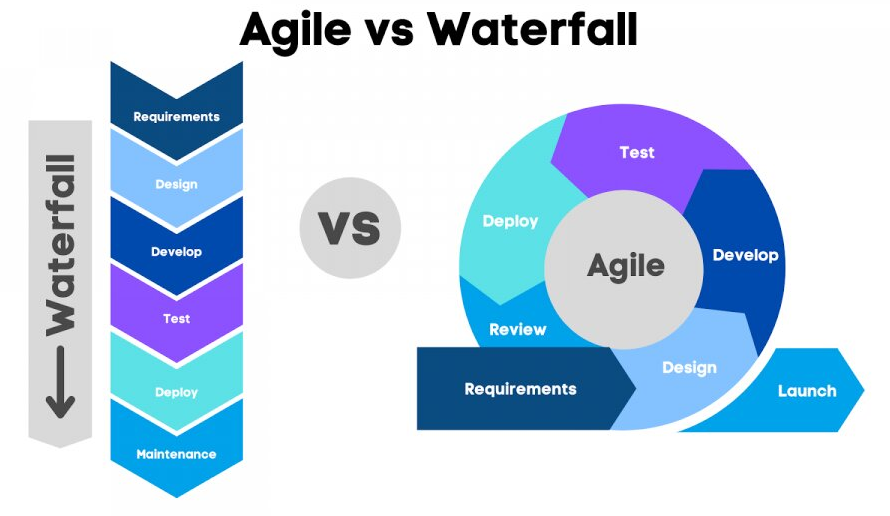

# Agile vs Waterfall

## Зміст

- [Що таке управління проєктами?](#що-таке-управління-проєктами)
- [Що таке методологія Agile в управлінні проєктами?](#що-таке-методологія-agile-в-управлінні-проєктами)
- [Що таке методологія Waterfall в управлінні проєктами?](#що-таке-методологія-waterfall-в-управлінні-проєктами)
- [Agile Methodology vs Waterfall Methodology в управлінні проектами](#agile-methodology-vs-waterfall-methodology-в-управлінні-проектами)
- [Принципи методології Agile](#принципи-методології-agile)
- [Принципи Waterfall Methodology](#принципи-waterfall-methodology)
- [Переваги Agile Methodology Project Management](#переваги-agile-methodology-project-management)
- [Недоліки Agile Methodology Project Management](#недоліки-agile-methodology-project-management)
- [Переваги Waterfall Methodology](#переваги-waterfall-methodology)
- [Недоліки Waterfall Methodology](#недоліки-waterfall-methodology)
- [Підсумкова таблиця](#підсумкова-таблиця)
- [Висновок](#висновок)

---

У управлінні проєктами дві методології, що виділяються своїми відмінними підходами — це Agile і Waterfall. Ці методи представляють протилежні підходи до планування, виконання та доставки проєктів. Waterfall — це традиційний лінійний підхід, де кожна фаза проєкту завершується послідовно перед переходом до наступної. На відміну від нього, Agile є ітеративним і гнучким, що дозволяє здійснювати постійне вдосконалення і адаптацію протягом усього життєвого циклу проєкту. Ця стаття розглядає відмінності між методологіями управління проєктами Agile та Waterfall, їх переваги та недоліки.

---

## Що таке управління проєктами?

Управління проєктами — це застосування знань, навичок, інструментів і технік до проєктних завдань для досягнення вимог проєкту. Це важлива дисципліна, яка забезпечує ефективне планування, виконання та завершення проєктів. Вона включає організацію ресурсів, постановку цілей та управління термінами для досягнення конкретних результатів. Чи то розробка нового продукту, запуск маркетингової кампанії або організація заходу — управління проєктами створює основу для оптимізації процесів, мінімізації ризиків і досягнення успішних результатів.

---

## Що таке методологія Agile в управлінні проєктами?

Agile — це ітеративний підхід до управління проєктами, що використовується для створення програмного забезпечення та додатків. Цей метод швидкий і простий у застосуванні як для малих, так і для великих проєктів, а також орієнтований на задоволення потреб клієнта. Agile найчастіше використовується, коли вимоги замовника часто змінюються. Три основні принципи цього підходу:

- Адаптація  
- Співпраця  
- Задоволення клієнта  

Метод Agile не може бути ефективним без довіри між членами команди. Для цього потрібне сприятливе середовище для відкритого спілкування між усіма учасниками. Регулярний обмін оновленнями та ідеями є ключовим, а учасники повинні бути впевнені в компетенції один одного.

---

## Що таке методологія Waterfall в управлінні проєктами?

Waterfall — це послідовний підхід до управління проєктами, що складається з фаз, кожна з яких охоплює окремий етап розробки продукту. Оскільки це послідовний процес, нова фаза не може початися до завершення попередньої. Через це важко вносити зміни після завершення фази, тому цей підхід не підходить для складних проєктів.

## Agile Methodology vs Waterfall Methodology в управлінні проектами

| Agile Project Management                                  | Waterfall Project Management                                   |
|----------------------------------------------------------|----------------------------------------------------------------|
| Вхідні дані від клієнта потрібні протягом усього розроблення продукту. | Вхідні дані від клієнта потрібні лише після завершення кожної фази. |
| Зміни можна вносити на будь-якому етапі.                 | Зміни не можна вносити після завершення фази.                  |
| Потрібна координація між командами для забезпечення правильності. | Координація не потрібна, оскільки одна команда починає роботу після завершення іншої. |
| Дуже корисний для великих і складних проєктів.            | В основному використовується для розробки невеликих проєктів.  |
| Тестування може починатися до завершення розробки всього продукту. | Тестування можна виконувати тільки після готовності всього продукту. |
| Для Agile достатньо невеликої команди.                    | Потрібна велика команда.                                        |
| Вартість розробки нижча.                                 | Вартість розробки вища.                                         |
| Завершує проєкт відносно швидше.                         | Потребує більше часу у порівнянні з Agile.                      |
| Agile відомий своєю гнучкістю.                           | Waterfall — це структурована методологія, тому вона досить жорстка. |
| Після кожного спринту/циклу обговорюється тестовий план. | Практично не обговорюється тестовий план під час циклу.         |

---

## Принципи методології Agile

Agile — це сучасний підхід до управління проєктами, який наголошує на гнучкості, співпраці та поступовій доставці результатів. Він розроблений для адаптації до непередбачуваності через ітеративні цикли планування, виконання та оцінки. Нижче наведені основні принципи Agile:

**Ітеративність і інкрементальність:** Проєкти Agile діляться на короткі ітерації або спринти, зазвичай тривалістю 1-4 тижні. Кожна ітерація дає потенційно придатну функціональність продукту.

**Співпраця з клієнтом:** Команди Agile надають пріоритет співпраці з клієнтом і зворотному зв’язку. Вони тісно працюють із зацікавленими сторонами, щоб зрозуміти і доставити те, що справді потрібно клієнту.

**Адаптивність до змін:** Agile приймає зміни вимог протягом усього життєвого циклу проєкту. Заохочує постійну адаптацію та гнучкі реакції на зміни.

**Самоорганізовані команди:** Команди Agile є крос-функціональними і самоорганізованими, в них працюють фахівці з різних дисциплін, об’єднані для досягнення цілей проєкту.

**Часті поставки робочого програмного забезпечення:** Agile орієнтований на часту доставку працюючого ПЗ, зазвичай кожні кілька тижнів, щоб максимізувати цінність для клієнта.

**Постійне вдосконалення:** Agile заохочує постійне вдосконалення і навчання. Команди регулярно аналізують свої процеси і коригують їх для підвищення ефективності.

**Прозоре і відкрите спілкування:** Agile сприяє прозорому обміну інформацією в команді та зі стейкхолдерами. Інформація поширюється відкрито для побудови довіри і узгодженості.

**Фокус на якості:** Команди Agile підтримують сталість розробки, прагнуть до високих стандартів роботи через увагу до технічної досконалості та якісного дизайну.

**Рання і передбачувана доставка:** Agile забезпечує ранню і передбачувану доставку продуктів, з інкрементальними релізами, що дозволяє планувати реалістично і підвищує задоволеність стейкхолдерів.

**Тісна співпраця розробників і бізнес-користувачів:** Agile наголошує на щоденній тісній взаємодії між розробниками та бізнес-людьми.

## Принципи Waterfall Methodology

Waterfall широко застосовується у галузях, де вимоги Waterfall широко застосовується у галузях, де вимоги стабільні, а зміни дорогі або трудомісткі. Це характерно для таких сфер, як будівництво, промислове виробництво, проекти з чіткими нормативами (наприклад, авіація чи космічна галузь), а також великі корпоративні ІТ-системи з суворими юридичними або безпековими вимогами.

**Послідовний потік:** Фази проєкту виконуються послідовно — після завершення аналізу вимог команда переходить до дизайну, потім до розробки, тестування і лише потім до впровадження. Це забезпечує чіткий контроль над кожним етапом і знижує ймовірність пропуску важливих кроків.

**Орієнтація на документацію:** Кожна фаза передбачає створення детальної документації - специфікацій, діаграм, технічних описів, планів тестування. Це важливо для узгодження всіх зацікавлених сторін (замовник, підрядники, регулятори) і полегшує передачу проєкту між командами чи поколіннями розробників.

**Жорстка структура:** Кожен етап має чітко визначені результати — наприклад, затверджений технічний проєкт або завершений модуль коду. Без завершення попереднього етапу не можна переходити до наступного, що мінімізує хаотичність у виконанні великих і комплексних робіт.

**Обмежена гнучкість:** Якщо під час реалізації з’являється потреба внести зміни у вимоги чи дизайн, це часто потребує повернення до попередніх фаз і повного перегляду вже виконаної роботи. Це робить Waterfall менш придатним для проєктів, де очікуються часті зміни або невизначеність.

**Управління ризиками:** Оскільки всі вимоги, ризики і залежності фіксуються на початкових етапах, можна заздалегідь оцінити всі критичні точки, спланувати шляхи уникнення проблем і передбачити резерви часу та бюджету. Це робить Waterfall привабливим для проєктів, де помилки або непередбачені зміни можуть призвести до значних втрат.

**Підходить для стабільних вимог:** Waterfall ідеально підходить для ситуацій, де і замовник, і розробники мають чітке розуміння кінцевого продукту і де очікується мінімальна кількість змін протягом життєвого циклу проєкту. Це часто стосується державних тендерів, великих інфраструктурних проєктів або виробництва складного обладнання.

---

## Переваги та недоліки методологій Agile і Waterfall у управлінні проєктами

### Переваги Agile Methodology Project Management

- **Гнучкість:** Agile дозволяє команді швидко адаптуватися до змін вимог або ринкових умов навіть під час активної розробки. Це особливо важливо для проєктів, де специфікації можуть змінюватися в процесі.
- **Ефективність:** Agile передбачає доставку працюючих частин продукту у вигляді невеликих, послідовних інкрементів. Це дозволяє швидше отримати цінність від проєкту.
- **Залучення клієнта:** Клієнт бере активну участь на всіх етапах - від планування до приймання результатів, що підвищує відповідність продукту очікуванням і мінімізує ризик непорозумінь.
- Agile має швидший цикл зворотного зв’язку, оскільки команда регулярно демонструє проміжні результати замовнику, отримує коментарі та вносить необхідні зміни.
- Agile допомагає виявляти проблеми на ранніх етапах розробки завдяки постійному тестуванню, ретроспективам і рев'ю.
- Agile має більший потенціал для задоволення клієнтів, адже продукт формується спільно з ними і краще відповідає їхнім реальним потребам.
- Agile забезпечує кращу прозорість і відповідальність: щоденні стендапи, канбан-дошки або спринт-беклоги дозволяють всім учасникам бачити прогрес.
- Agile сприяє підвищенню продуктивності команд з часом - завдяки ретроспективам і постійному вдосконаленню процесів команда вчиться працювати швидше і ефективніше.

### Недоліки Agile Methodology Project Management

- **Складність:** Реалізація Agile може бути складною, особливо якщо команда не має достатнього досвіду чи відповідних технічних навичок. Потрібне постійне навчання і дисципліна.
- **Відсутність передбачуваності:** Через гнучкість Agile складно з самого початку точно визначити обсяг, бюджет і кінцеві терміни проєкту. Це може створювати труднощі для фінансового планування або укладання контрактів.
- **Документація:** Agile фокусується на робочому продукті більше, ніж на документації, що може ускладнити подальше обслуговування, передачу проєкту іншим командам або масштабування.
- Критичний шлях і залежності між завданнями іноді не прописуються так чітко, як у Waterfall, що може призвести до неочікуваних затримок.
- Справжнє впровадження Agile часто потребує глибокої перебудови процесів, зміни культури команди та додаткових витрат на навчання і координацію.

### Переваги Waterfall Methodology

- **Простота розуміння:** Модель Waterfall логічно послідовна і зрозуміла: кожен етап виконується один за одним, що полегшує керування великими командами.
- **Передбачуваність:** Замовник отримує чітке уявлення про бюджет, терміни і кінцевий обсяг робіт ще до старту розробки. Це зручно для контрактів з фіксованою ціною.
- **Документація:** Докладна документація створюється на кожному етапі: від аналізу до тестування. Це робить підтримку і модернізацію системи легшою у довгостроковій перспективі.
- **Методичний дизайн:** Поглиблена робота над проектуванням перед початком кодування зменшує ризик серйозних архітектурних помилок у подальшій розробці.
- **Чітка фаза проєкту:** Розділення проєкту на фази (аналіз, дизайн, розробка, тестування, впровадження) допомагає керувати залежностями між командами, підрядниками або зовнішніми постачальниками.

### Недоліки Waterfall Methodology

- **Відсутність гнучкості:** Якщо вимоги змінюються під час проєкту, їх реалізація часто потребує повернення до попередніх етапів, що призводить до значних затримок і перевитрат бюджету.
- **Неефективність:** Не можна почати наступну фазу, поки попередня не завершена повністю. Це створює затримки і робить проєкт менш гнучким до зовнішніх обставин.
- **Обмежене залучення клієнта:** Зазвичай клієнт підключається до процесу лише на початку (узгодження вимог) та в кінці (приймання продукту). Це підвищує ризик того, що кінцевий продукт не відповідатиме його очікуванням.
- Ризик втрати часу через перехід між фазами, коли члени команди можуть чекати на завершення попередніх робіт.
- Додаткові комунікаційні витрати виникають через потребу передавати великі обсяги документації між командами або підрядниками.
- Порівняно з Agile, власність продукту і залученість команди можуть бути менш вираженими, що іноді знижує мотивацію та ініціативність учасників проєкту.

## Підсумкова таблиця

| Критерій                 | Waterfall                                      | Agile                                           |
|--------------------------|------------------------------------------------|-------------------------------------------------|
| Гнучкість                | Низька, фіксований план                        | Висока, постійна адаптація                      |
| Зміни у вимогах          | Не бажані або неможливі                       | Вітаються навіть на пізніх етапах               |
| Документація             | Повна та обов’язкова                          | Мінімально необхідна                            |
| Тестування               | В кінці проєкту                               | Постійне протягом усього процесу                |
| Співпраця з замовником   | Мінімальна                                    | Постійна й активна                              |
| Управління ризиками      | Високі ризики виявляються пізно              | Ризики зменшуються завдяки ітераційному підходу |
| Швидкість поставки       | Один реліз наприкінці                         | Часті інкременти протягом усього проєкту        |

---

## Висновок

Вибір між методологіями управління проєктами Agile та Waterfall залежить від потреб конкретного проєкту. Waterfall підходить для проєктів із чіткими та стабільними вимогами, забезпечуючи структуроване планування та чіткі етапи. Agile є гнучким підходом, що краще підходить для проєктів з мінливими вимогами, дозволяючи постійно вдосконалюватися і швидше доставляти результат.

Обидві методології мають свої переваги та недоліки, і вибір повинен базуватися на таких факторах, як обсяг проєкту, терміни, динаміка команди та вимоги клієнта.
