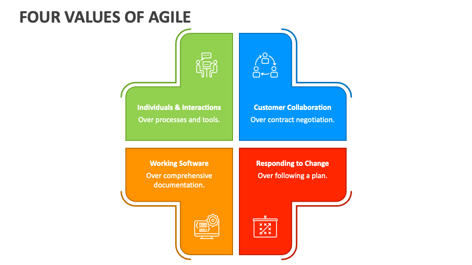
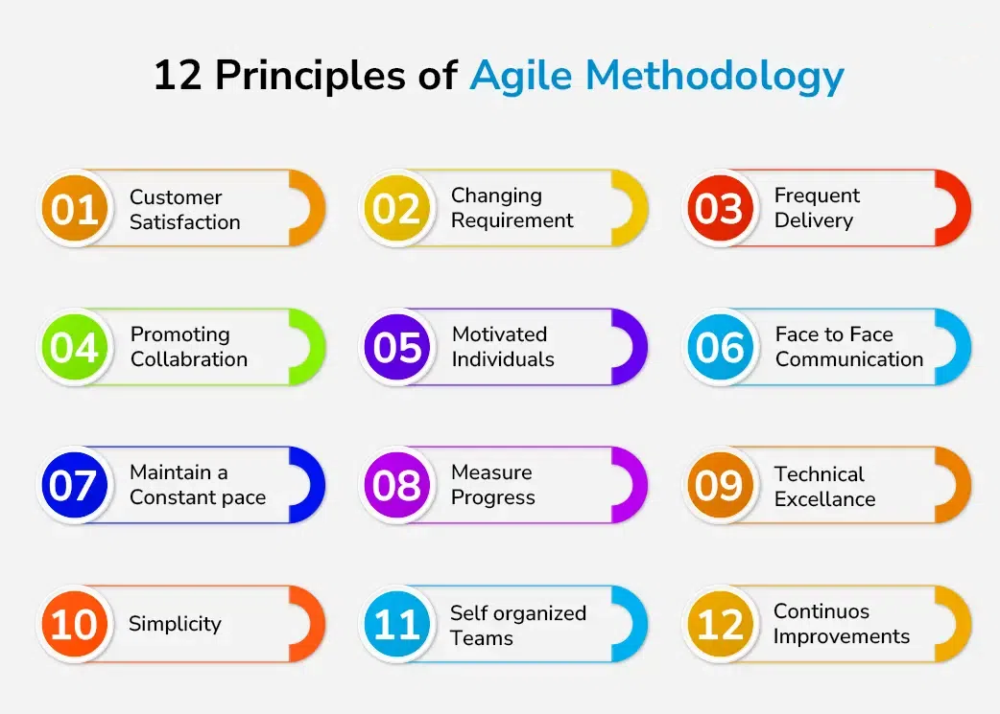

# Agile: Вступ та Основи

## Зміст

1. [Вступ: Що таке Agile?](#вступ-що-таке-agile)  
2. [Що таке Agile-методологія?](#що-таке-agile-методологія)  
3. [Історія Agile](#історія-agile)  
4. [Що таке Agile-маніфест?](#що-таке-agile-маніфест)  
5. [4 головні цінності Agile](#4-головні-цінності-agile)  
6. [12 принципів Agile](#12-принципів-agile)  
7. [Висновок](#висновок)

---

## Вступ: Що таке Agile?

**Agile** — це підхід до управління проєктами та розробки програмного забезпечення, який орієнтований на гнучкість, швидке реагування на зміни та створення цінності для замовника на кожному етапі.

Замість того, щоб робити одне велике впровадження наприкінці, команди Agile працюють маленькими ітераціями — постійно планують, створюють, перевіряють і вдосконалюють продукт.

> Agile — це не просто методологія. Це спосіб мислення.

Agile не обмежується певними техніками чи ритуалами. Це набір підходів, які ґрунтуються на швидкому зворотному зв’язку, тісній співпраці та безперервному вдосконаленні.

---

## Що таке Agile-методологія?

Agile-методологія — це спосіб управління проєктами шляхом поділу роботи на невеликі частини. Вона базується на:

- постійній командній взаємодії,
- гнучкому плануванні,
- регулярних перевірках результатів,
- швидкій адаптації до змін.

Цикл повторюється: **планування → розробка → перевірка → вдосконалення**. Цей підхід дозволяє швидше реагувати на потреби замовника і постійно підвищувати якість продукту.

Такі компанії як **Facebook**, **Google** та **Amazon** активно застосовують Agile завдяки його ефективності та орієнтованості на користувача.

---

## Історія Agile

- **1957** — з’являються перші ідеї ітеративної та інкрементальної розробки ПЗ.
- **1970-ті** — використовується адаптивна розробка (Adaptive Software Development) та еволюційне управління проєктами.
- **1990-ті** — зростає критика жорстких, "водоспадних" (Waterfall) методів. Розробники шукають більш гнучкі альтернативи.
- **2001** — у місті Сноубьорд, штат Юта, 17 фахівців створюють **Маніфест Agile-розробки програмного забезпечення** — ключовий документ, який визначив філософію Agile.

## Що таке Agile-маніфест?

Agile-маніфест (Agile Manifesto) — це короткий документ, створений у лютому 2001 року групою з 17 провідних розробників програмного забезпечення. Вони зібралися в місті Сноубьорд, штат Юта (США), щоб обговорити новий підхід до розробки, який би дозволяв бути гнучкішими, швидшими та ефективнішими в умовах змін.

В результаті було сформульовано 4 ключові цінності та 12 принципів, які стали основою підходу Agile. Ці ідеї стали фундаментом для багатьох фреймворків (Scrum, Kanban, XP та ін.) і трансформували уявлення про розробку програмного забезпечення, управління командами та продуктами.

---

## 4 головні цінності Agile

У Маніфесті чітко зазначено, що автори **не заперечують важливість процесів, документації, контрактів чи планування**, але **віддають перевагу іншим підходам**, які краще працюють у сучасному динамічному середовищі.

Головні цінності:

1. **Людей і взаємодію понад процеси та інструменти**  
   Успішний проєкт залежить передусім від ефективної командної роботи, комунікації та взаєморозуміння, а не від інструментів чи регламентів.

2. **Працююче програмне забезпечення понад вичерпну документацію**  
   Найкраща документація не має сенсу, якщо продукт не працює. У центрі Agile — створення корисного та робочого ПЗ.

3. **Співпрацю з замовником понад узгодження умов контракту**  
   Гнучкість і постійна взаємодія з клієнтом дозволяють швидше досягти бажаного результату, ніж дотримання жорстких контрактних зобов’язань.

4. **Реакцію на зміни понад слідування початковому плану**  
   Замість того, щоб сліпо йти за планом, Agile-команди адаптуються до змін у вимогах, ринку чи середовищі, забезпечуючи кращу відповідність очікуванням.

Ці цінності стали ядром Agile-культури й визначають її філософію. Вони не диктують конкретні правила, а створюють рамки для прийняття рішень у складних та змінних умовах.

---

## 12 принципів Agile

Принципи, сформульовані в Маніфесті, конкретизують ідеї, закладені в чотирьох цінностях. Вони описують поведінку, підходи та орієнтири, які мають дотримуватися команди, що працюють за Agile.

Принципи Agile:

1. **Найвищий пріоритет — задоволення клієнта**  
   Команда має фокусуватися на постійній і ранній доставці цінного програмного забезпечення.

2. **Готовність до змін навіть на пізніх етапах розробки**  
   Agile-команди приймають зміни як позитивну можливість, а не як перешкоду, навіть якщо вимоги змінюються на фінальних етапах.

3. **Часта доставка працюючого продукту**  
   Програмне забезпечення має поставлятися часто — кожні декілька тижнів або місяців, з пріоритетом на коротші ітерації.

4. **Співпраця між бізнесом і розробниками щодня**  
   Замовники, бізнес-представники та розробники повинні взаємодіяти щодня, щоб досягти спільного розуміння та узгоджених рішень.

5. **Побудова проєктів навколо мотивованих людей**  
   Команді слід надати підтримку, довіру та умови для ефективної роботи. Саме такі команди досягають найкращих результатів.

6. **Найефективніше спілкування — особисте**  
   Передавання інформації «віч-на-віч» є найкращим способом забезпечити розуміння та швидке вирішення питань.

7. **Робоче програмне забезпечення — головний критерій прогресу**  
   Успішність вимірюється не планами чи кількістю виконаних задач, а реально працюючим продуктом.

8. **Підтримка сталого темпу роботи**  
   Agile-процеси сприяють стабільному ритму розробки, що дозволяє уникнути вигорання та перевантаження.

9. **Постійна увага до технічної досконалості та якісного дизайну**  
   Це забезпечує гнучкість, швидкість внесення змін і стійкість продукту до помилок.

10. **Простота — ключ до ефективності**  
   Найкращі рішення — прості. Не слід робити зайвого. Важливо фокусуватись на тому, що справді створює цінність.

11. **Найкращі рішення виникають у самоорганізованих командах**  
   Команди, які самі приймають рішення, швидше адаптуються, працюють ефективніше та проявляють ініціативу.

12. **Регулярні ретроспективи для вдосконалення процесу**  
   Команда має періодично аналізувати свою роботу, виявляти слабкі місця й постійно вдосконалювати процеси.

## Висновок

Agile — це не просто набір інструментів чи методик, а комплексний підхід, який базується на цінностях та принципах, спрямованих на гнучкість, ефективну комунікацію та створення справжньої цінності для клієнта. Розуміння і застосування чотирьох ключових цінностей та дванадцяти принципів допомагає командам адаптуватися до змін, швидко реагувати на нові виклики та підтримувати високу якість продукту.

Цей підхід вже довів свою ефективність у провідних світових компаніях і продовжує залишатися ключовим у сучасній розробці програмного забезпечення. Вивчення та впровадження Agile — це крок до більш адаптивної, прозорої та успішної роботи над будь-якими проєктами.