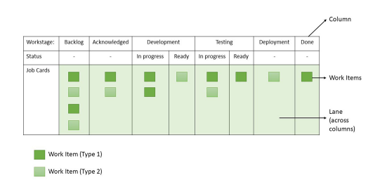
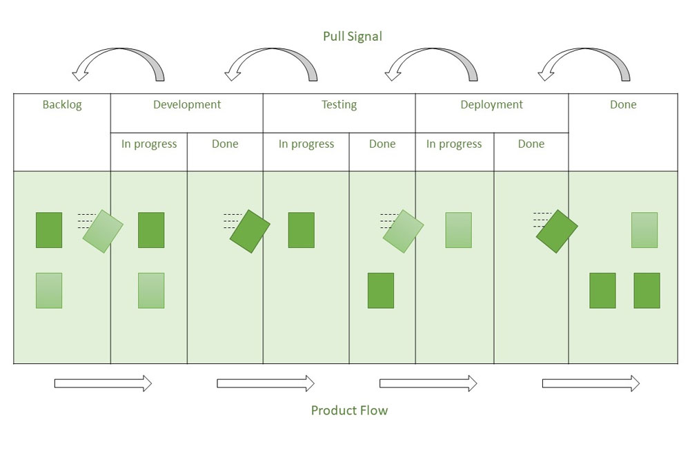
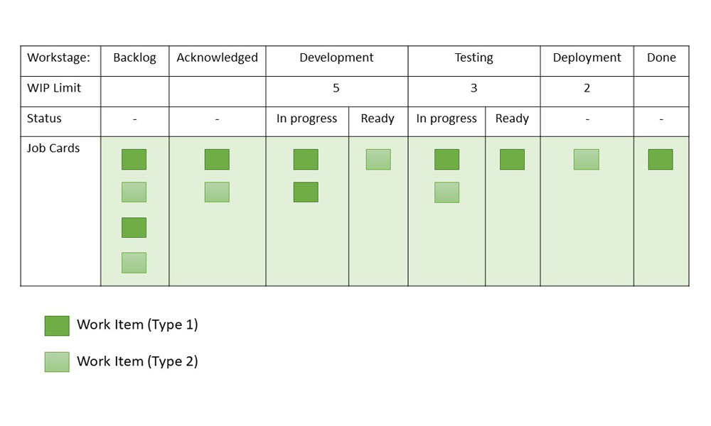
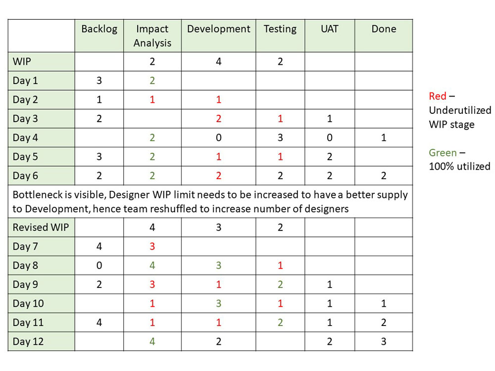
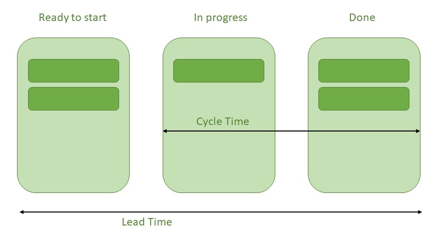
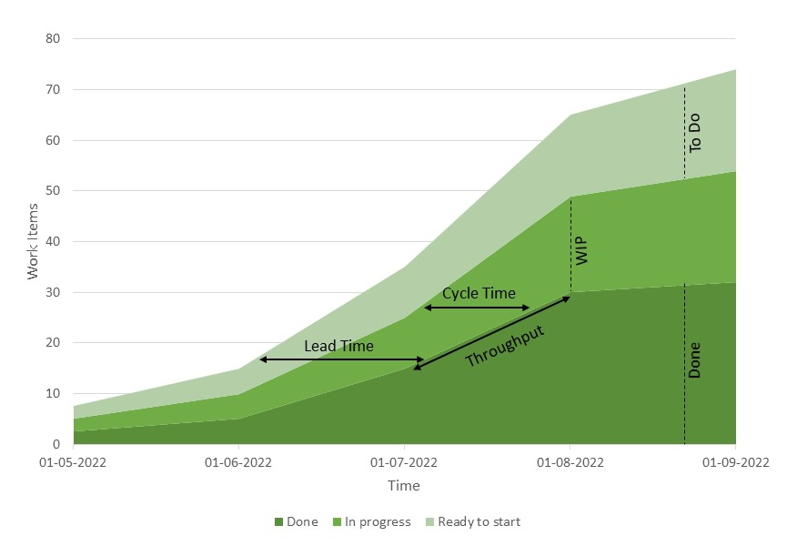
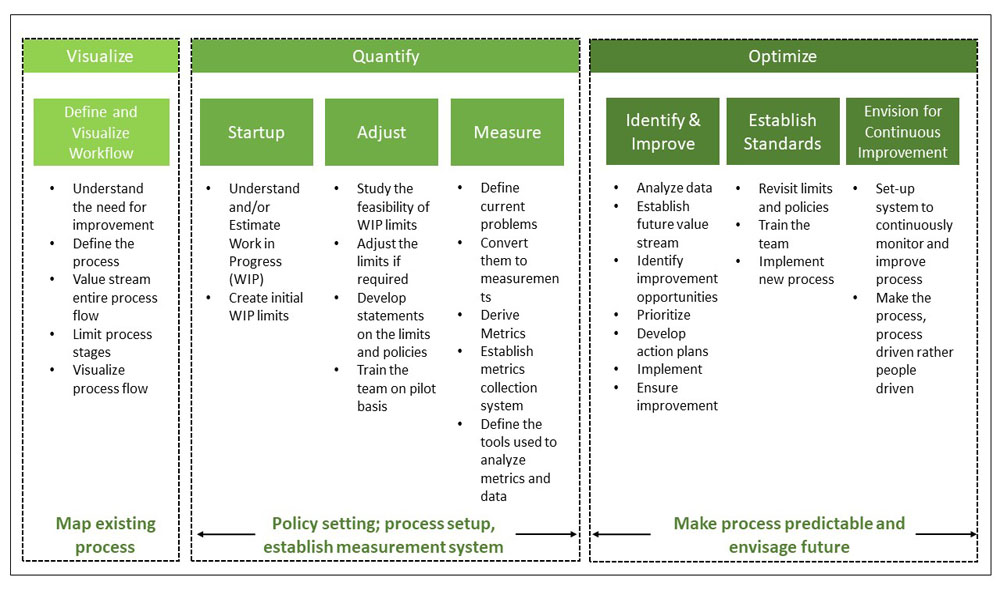

# Kanban

## Зміст

- [Що таке Kanban?](#що-таке-kanban)
- [Коли потрібен підхід Kanban?](#коли-потрібен-підхід-kanban)
- [Kanban-дошка та картки](#kanban-дошка-та-картки)
- [Принципи Kanban](#принципи-kanban)
- [Практики Kanban](#практики-kanban)
- [Як працює Kanban: Pull-система](#як-працює-kanban-pull-система)
- [Lead Time та Cycle Time](#lead-time-та-cycle-time)
- [Кумулятивна діаграма потоку CFD](#кумулятивна-діаграма-потоку-cfd)
- [Як розрахувати Lead Time і Cycle Time](#як-розрахувати-lead-time-і-cycle-time)
- [Кроки впровадження Kanban](#кроки-впровадження-kanban)
- [Переваги Kanban](#переваги-kanban)
- [Порівняння Kanban і Scrum](#порівняння-kanban-і-scrum)
- [Висновок](#висновок)

---

## Що таке Kanban?

Kanban — популярна методологія гнучкої розробки програмного забезпечення. Це сигналізуючий пристрій, який контролює рух деталей у системі виробництва "pull", розробленій в рамках Toyota Production System (TPS). Kanban — це спосіб візуалізації існуючого робочого процесу у вигляді послідовних кроків. Ці кроки можуть бути створені на дошці.

Основна мета Kanban — зменшити обсяг роботи в процесі (WIP, Work-In-Progress) між етапами, забезпечуючи, щоб кожен попередній процес виробляв частини лише тоді, коли їх потребує наступний. Kanban допомагає швидко просувати робочі елементи вперед, прискорюючи отримання бізнес-цінності.

Kanban сьогодні широко використовується в agile-командах та DevOps-командах у сфері розробки програмного забезпечення, однак сама методологія Kanban з’явилася понад 50 років тому. Наприкінці 1940-х років компанія Toyota почала оптимізувати свої інженерні процеси, спираючись на ту саму модель, яку використовували супермаркети для поповнення полиць товарами.

Супермаркети зберігають на полицях рівно стільки товару, скільки потрібно для задоволення попиту споживачів. Такий підхід оптимізує потік між супермаркетом і покупцем. Завдяки тому, що рівень запасів відповідає споживчим патернам, супермаркет значно підвищує ефективність управління запасами, зменшуючи надлишки товару, які потрібно зберігати у будь-який момент. Водночас супермаркет може гарантувати, що необхідні товари завжди є в наявності.

Коли Toyota застосувала цю ж систему на своїх виробничих майданчиках, метою було краще узгодити величезні запаси матеріалів із фактичним споживанням. Щоб передавати інформацію про наявність ресурсів у реальному часі на виробництві (і постачальникам), працівники передавали між командами картку — «kanban».

Коли хтось спустошував контейнер із матеріалами на виробничій лінії, kanban-картка передавалася на склад із зазначенням, який саме матеріал потрібен, у якій кількості тощо. На складі готували новий контейнер із цим матеріалом і відправляли його на виробничу лінію, а склад у свою чергу надсилав свій kanban постачальнику. Хоча цей процес еволюціонував із 1940-х років, принцип «just in time» (виробництво точно вчасно) і досі лежить в основі методології Kanban.

---

## Коли потрібен підхід Kanban?

Kanban найкраще підходить у таких випадках:

- Часті динамічні зміни вимог, які потрібно швидко впроваджувати.
- Коли пріоритети змінюються, і команда може брати найважливіші завдання при звільненні WIP.
- Часті періодичні релізи.
- Постійний потік нової роботи.
- Пріоритети завдань потрібно визначати динамічно.
- Підходить для підтримки або проектів з тикетами.
- Можна застосовувати в різних функціях: маркетинг, продажі, HR.

Kanban не підходить для:

- Завдань, що довго знаходяться у стані очікування.
- Дослідницьких проектів.
- Проектів з нечіткими або еволюційними вимогами.
- Проектів з високою залежністю між завданнями.
- Якщо всі елементи потрібно зібрати перед розгортанням.

---

## Kanban-дошка та картки

Робота всіх команд, що використовують Kanban, обертається навколо Kanban-дошки — інструмента, який допомагає візуалізувати та оптимізувати робочий процес у межах команди або кількох команд. Деякі команди надають перевагу фізичним дошкам, однак в умовах гнучкої розробки програмного забезпечення вирішальне значення мають віртуальні Kanban-дошки — вони забезпечують простежуваність, спільну роботу та доступність з різних місць.

Незалежно від того, чи команда користується цифровою чи фізичною Kanban-дошкою, вона дозволяє візуалізувати роботу, стандартизувати робочий процес і своєчасно виявляти та усувати всі блокери й залежності. Базова Kanban-дошка складається з трьох етапів: До виконання (To Do), В роботі (In Progress) та Виконано (Done). Проте залежно від розміру команди, її структури та цілей, робочий процес можна налаштувати під конкретні потреби.

Оскільки методологія Kanban ґрунтується на повній прозорості роботи та комунікації в реальному часі, Kanban-дошка виступає єдиним джерелом правди щодо стану завдань команди.

- Кожне отримане завдання розміщується на дошці.
- Кожен стовпець відповідає певному етапу (наприклад: Отримано, В роботі, Тестування, Готово).
- Команда може обирати назви етапів, зручні для них.
- Дошка може бути фізичною (білою дошкою + стікерами) або електронною (Jira, Rally тощо).
- Дошка сигналізує, якщо завдання надовго затримується на якомусь етапі.
- Можна відслідковувати час перебування завдань у кожній стадії.

Японською мовою слово «kanban» буквально означає «вивіска» або «табло». У Kanban-командах кожен елемент роботи представлений окремою карткою на дошці. Основна мета відображення завдань у вигляді карток на Kanban-дошці полягає в тому, щоб дати учасникам команди можливість відстежувати хід виконання роботи максимально наочно.

Kanban-картки містять важливу інформацію про завдання проєкту: хто відповідає за виконання, короткий опис роботи та орієнтовний час виконання. Картки на віртуальних Kanban-дошках часто доповнюються скріншотами чи іншими технічними деталями, корисними для виконавця.

Можливість бачити стан кожного завдання у будь-який момент разом із супровідною інформацією підвищує зосередженість команди, забезпечує повну простежуваність і сприяє швидкому виявленню блокерів і залежностей.

---

## Принципи Kanban

### 1️ **Починати з існуючого процесу**  

  Kanban — це метод управління змінами, який починається з існуючого процесу. Зміни впроваджуються в систему поступово та еволюційно. На відміну від Scrum, у Kanban немає чітко визначеного процесу або ролей.

### 2️ **Погодитись на еволюційні та інкрементальні зміни**  

Після старту з існуючого процесу команда повинна погодитися на безперервні, поступові та еволюційні зміни. Зміни повинні бути невеликими та інкрементними. Швидкі та масштабні зміни можуть бути ефективними, але команда буде чинити їм більший опір.

### 3️ **Поважати поточні ролі і відповідальності**  

   Хоча Kanban пропонує постійні поступові зміни у процесі, він поважає поточні ролі, обов’язки та посадові титули. Це допомагає команді набратися впевненості на початку роботи з Kanban.

### 4️ **Лідерство на всіх рівнях**  

   Kanban не очікує лідерства лише від визначеного кола осіб — навпаки, дії лідерства на всіх рівнях організації всіляко заохочуються.

---

## Практики Kanban

1. **Обмеження WIP**  
   Обмеження обсягу роботи, що виконується одночасно (Work-In-Process), означає, що система PULL (витягування) впроваджується для окремих частин або всього робочого процесу. Це виступає одним із ключових стимулів для поступових, безперервних та еволюційних змін у системі. Обмеження WIP встановлює чіткі межі кількості завдань, які можуть перебувати в роботі на кожному етапі.

2. **Візуалізація робочого процесу**  
   Візуалізація робочого процесу та його наочність важливі для розуміння того, як рухається робота. Без розуміння потоку роботи важко вносити потрібні зміни. Зазвичай для цього використовується дошка з картками та колонками. Колонки на дошці відображають різні стани або кроки робочого процесу.

3. **Управління потоком**  
   Потік роботи через усі стани робочого процесу має спостерігатися, вимірюватися та аналізуватися. Активне управління потоком дозволяє оцінювати, чи мають поступові зміни позитивний чи негативний вплив на систему.

4. **Спільне покращення, експериментальний розвиток**  
   Kanban заохочує невеликі, поступові та постійні зміни. Коли команди мають спільне розуміння завдань, процесів, потоку роботи та ризиків, вони можуть краще формулювати спільне бачення проблеми та пропонувати покращення, що досягають консенсусу.

5. **Зворотний зв’язок**  
   Ранній зворотний зв’язок від клієнтів і використання системи витягування (PULL) є важливими для Kanban. Якщо отримувати відгуки від різних зацікавлених сторін та етапів процесу, це допоможе знизити ризики та оптимізувати процес постачання.

6. **Чіткість політик**  
   Поки механізми процесу не будуть чітко визначені, важко вести обговорення та шукати шляхи його покращення. Без розуміння того, як реально виконується робота, обговорення ускладнень стають емоційними та суб’єктивними. Чітке визначення політик дозволяє вести раціональн

---

## Як працює Kanban: Pull-система

### Крок 1. Візуалізуйте робочий процес  

- Визначте етапи роботи та робочі елементи
- **Робочі елементи**: максимальний обсяг роботи на 2 дні, щоб завдання були короткими і рухались швидко.
  - Запишіть робочі елементи на картках і прикріпіть їх у відповідні колонки, які відповідають етапам робочого процесу — зліва направо.
  - Робочий процес можна зобразити фізично (наприклад, на дошці) або за допомогою інструментів, таких як Jira.
- **Приклади етапів**: Дизайн, Розробка, Тестування, Виробництво, Розгортання, Виконано.
  - Кожен етап можна розділити на підетапи — Готово до роботи (Ready) і В роботі (In Progress).
  - Спочатку ці підетапи можуть бути відсутні, але згодом їх вводять для контролю часу очікування на кожному етапі.

### Крок 2. Встановіть Pull-систему  

Замість того, щоб "штовхати" завдання в процес, команда витягує роботу лише тоді, коли вона потрібна і коли є достатня ємність для її виконання.

Колонки "В роботі" (In Progress) і "Виконано" (Done) присутні на кожному етапі процесу. Наприклад, коли завдання розробки завершено, воно переміщується до колонки "Розробка (Виконано)".

Статуси черги — це ті колонки "Виконано", в яких завдання просто очікують; ніхто над ними не працює, тому вони пасивні.

У прикладі "Розробка (Виконано)" — це черга, з якої команда тестування витягує завдання, готові до тестування, коли має змогу.

Витягування роботи допомагає уникати мультизадачності і концентруватися на найважливіших завданнях.

Це призводить до вищої продуктивності і скорочення циклів виконання, що означає задоволених клієнтів і більший прибуток.

### Крок 3. Обмежте WIP  

Встановіть систему витягування, задавши обмеження WIP (Work-In-Process), і дотримуйтесь правила "Припинити починати нові завдання і почати завершувати поточні". Після завершення завдання на поточному етапі члени команди можуть витягнути завдання з попереднього етапу, звільняючи ємність. Цей процес триває доти, доки надходять нові заявки/помилки.

- Обмеження WIP можуть встановлюватися на основі історичних даних і планування потужностей
- Якщо завдань накопичується багато на одному етапі, інші члени команди допомагають, щоб рух завдань був плавним — це підвищує співпрацю.
- Обмеження WIP слід спостерігати протягом 3-4 тижнів і коригувати відповідно до досвіду команди.

 Приклад Kanban-дошки з лімітами WIP:

### Приклад обмеження WIP для етапу "Аналіз впливу" у проекті ABC

- Історичні дані: команда витрачає в середньому 4 години на аналіз впливу.
- У фазі аналізу працюють 2 дизайнери.
- Кожен дизайнер виділяє на проект по 5 годин на день.
- Потужність фази: 5 годин × 2 ресурси = 10 годин.
- Отже, обмеження WIP має бути 2 для етапу "Аналіз впливу".
- Аналогічно розрахуйте обмеження для етапів розробки та тестування.
- Зазвичай WIP не повинен перевищувати кількість людей на етапі.

Якщо обмеження WIP порушено, це можна зафіксувати на дошці і визначити допустимі межі порушень. кщо порушення повторюються, обмеження слід переглянути.

Дошка Kanban також може включати інформацію про заблоковані завдання. Обмеження WIP варто встановлювати з урахуванням контексту проекту.

### Крок 4. Використовуйте сигнали Pull  

Використання сигналів витягування для позначення, що нові завдання готові до роботи, — важлива частина системи Pull. Коли кількість карток у колонці опускається нижче заданого ліміту, генерується сигнал витягування. Це означає, що попередня колонка може "витягнути" нове завдання для подальшої роботи. Не можна витягувати нові завдання, якщо ліміт WIP досягнуто, доки не буде завершено одне з поточних. Це допомагає уникнути перевантаження команди та пропусків у роботі.

---

## Lead Time та Cycle Time

- **Lead Time** — загальний час від моменту появи завдання у системі до його завершення.
- **Cycle Time** — час активної роботи над завданням (від початку роботи до завершення).

### Відношення між Cycle Time і Lead Time

Головна різниця — в одиницях вимірювання:

- Cycle Time вимірюється як час на одиницю/процес/завдання.
- Lead Time вимірюється як загальний пройдений час (тижні, години, секунди).

Закон Літтла (Little's Law) описує зв’язок:  
Cycle Time × WIP = Lead Time

---

## Кумулятивна діаграма потоку CFD

У **Kanban** кумулятивна діаграма потоку (**CFD**) — це потужний аналітичний інструмент.  
Вона дозволяє командам бачити, як візуалізуються їхні зусилля у робочому процесі та загальний прогрес проєкту.  
За допомогою CFD команди можуть відстежувати стабільність свого потоку завдань, передбачати вузькі місця (*bottlenecks*), своєчасно коригувати робочий процес та робити його більш передбачуваним.

## **Три ключові параметри CFD**

- **Cycle time (Цикл часу)**: Загальний час, який витрачає команда на виконання кожного завдання від початку до кінця.
- **Work in progress (WIP, Робота в процесі)**: Кількість завдань, над якими команда працює зараз.
- **Throughput (Пропускна здатність)**: Кількість завдань, які команда може завершити за певний проміжок часу.

---

## Як розрахувати Lead Time і Cycle Time

Якщо використовується правильне програмне забезпечення для управління проєктами і всі дані доступні, то обчислення **Lead Time** (часу виконання) та **Cycle Time** (цикл часу) для будь-якого проєкту є простим завданням.  
Найпростішим і найпоширенішим методом оцінки обох показників є використання **Cumulative Flow Diagram (CFD)** (*кумулятивної діаграми потоку*).

### **Що таке CFD**

**CFD** — це графік, який відображає прогрес проєкту у вигляді кривої. На вертикальній осі показані одиниці *WIP* (*Work In Progress*), а на горизонтальній осі — час. CFD поділяється на сегменти, кожен з яких відповідає певній колонці на Kanban-дошці. Основні поділи: **плановані завдання**, **завдання в роботі** та **завершені завдання** — як і на звичайній Kanban-дошці. За потреби можна додати більше секцій для більш детального відстеження прогресу.

### **Як розрахувати Lead Time**

- Щоб визначити **Lead Time**, інтерпретуйте дані від моменту, коли запит потрапляє у систему (*Backlog*), проходить через процес (*In Progress*), і досягне завершення (*Completed*).
- **Lead Time** — це часовий проміжок від початку до кінця цього шляху

### **Як розрахувати Cycle Time**

- Для розрахунку **Cycle Time** перший етап (*Backlog*) пропускається.
- Цикл часу починається з моменту, коли робота над завданням фактично стартує (*In Progress*), і триває до його завершення (*Completed*).
- **Cycle Time** визначається як витрачений час на одиницю завдання.

---

## Кроки впровадження Kanban

### **Крок 1. Візуалізація**

Цей крок передбачає визначення та візуалізацію робочого процесу.

- Зрозуміти потребу в покращенні.
- Визначити процес.
- Побудувати картину потоку створення цінності (Value Stream).
- Візуалізувати потік процесу.

### **Крок 2. Квантифікація**

Цей крок включає три види діяльності:

#### **Запуск:**

- Зрозуміти та/або оцінити обсяг роботи в процесі (WIP).
- Встановити початкові ліміти WIP.
- Відкоригувати:
  - Вивчити доцільність встановлених WIP-лімітів.
  - За потреби відкоригувати ліміти.
  - Розробити правила та політики для лімітів.
  - Провести навчання команди на пілотному етапі.

#### **Вимірювання:**

- Визначити наявні проблеми.
- Перетворити проблеми у вимірювані показники.
- Вивести необхідні метрики.
- Створити систему збору метрик.
- Визначити інструменти для аналізу метрик та даних.

### **Крок 3. Оптимізація**

Цей крок включає такі три види діяльності:

#### **Виявлення та покращення:**

- Аналізувати зібрані дані.
- Визначити майбутній Value Stream.
- Виявити можливості для покращення.
- Розставити пріоритети.
- Розробити план дій.
- Реалізувати план дій.
- Забезпечити впровадження покращень.

#### **Встановлення стандартів:**

- Переглянути ліміти та політики.
- Провести навчання команди.
- Впровадити новий процес.

#### **Формування безперервного покращення:**

- Створити систему для постійного моніторингу та покращення процесів.
- Зробити процес керованим процесом, а не людьми.

---

## Переваги Kanban

- Обмеження роботи в процесі (WIP) та встановлення правил призводять до кращого фокусу на якості, що в результаті підвищує задоволеність клієнтів.
- Використання прозорості для покращення процесів.
- Мінімізація втрат.
- Менше витрат на процеси.
- Чіткіший і передбачуваний темп гарантує, що учасники команди не перевантажуються.
- Дозволяє швидко змінювати пріоритети, щоб адаптуватися до змін ринкового попиту.
- Кращий потік завдань.
- Можна змінювати склад команди.
- Допомагає підвищити продуктивність команди.
- Пріоритизація допомагає оптимізувати процеси та робочий потік.
- Підвищення якості роботи.
- Виявлення та усунення вузьких місць.
- Скорочення часу простою в чергах.
- Зменшення марної витрати зусиль.

---

## Порівняння Kanban і Scrum

| №  | Kanban | Scrum |
|----|--------|-------|
| 1. | Планування, реліз і покращення процесу можуть мати окремі цикли. | Ітерація має фіксований час (таймбокс). |
| 2. | Для планування і покращення процесу використовується *lead time* як основна метрика. | Для планування і покращення процесу використовується *Velocity* як основна метрика. |
| 3. | Крос-функціональні команди необов’язкові. | Крос-функціональні команди є обов’язковими. |
| 4. | Відстеження проєкту: для розуміння прогресу робочого процесу можна використовувати CFD (*Cumulative Flow Diagram*). | Відстеження проєкту: рекомендована діаграма *Burndown*. |
| 5. | Обмеження WIP встановлюється напряму (для кожного стану робочого процесу). | Обмеження WIP встановлюється опосередковано (для спринту). |
| 6. | Нові завдання можна додавати, коли WIP падає нижче ліміту. | Нові завдання не можна додавати до поточної ітерації. |

---

## Висновок

Kanban — простий та ефективний метод покращення процесів, який допомагає командам візуалізувати роботу, контролювати навантаження і швидко реагувати на зміни. Його легко впровадити без значних змін у структурі команди. Kanban підходить для команд, які прагнуть підвищити гнучкість та прозорість у роботі.
