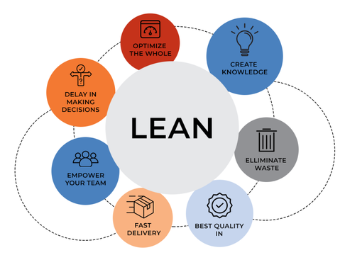
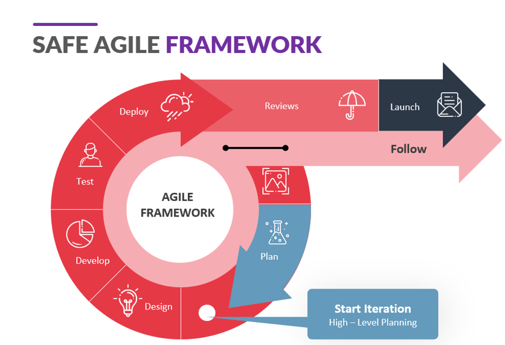
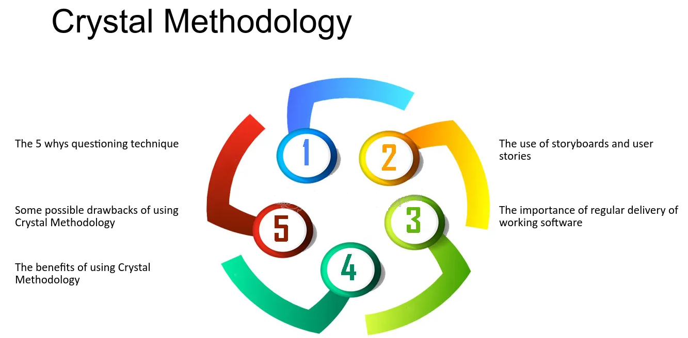
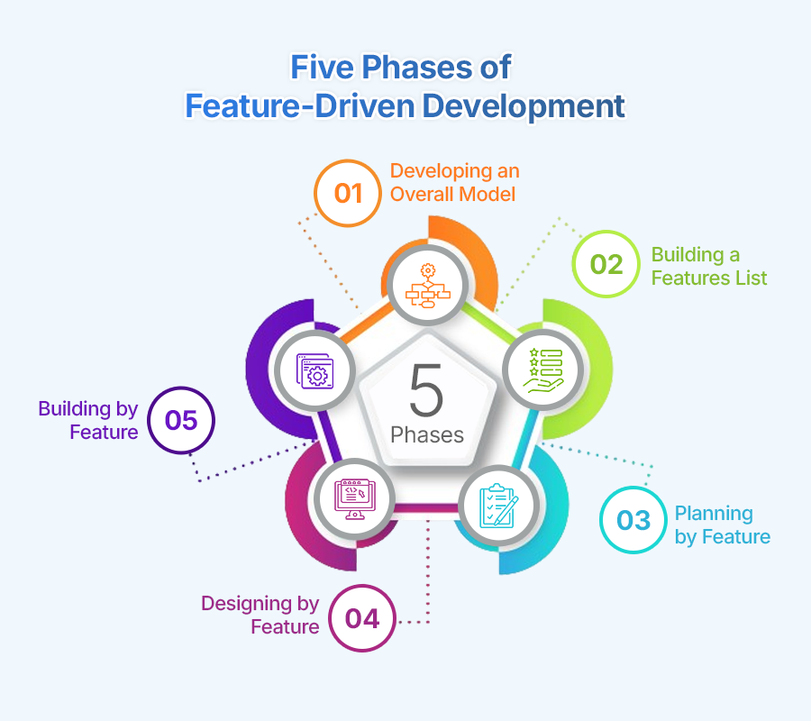
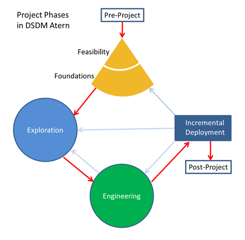

# Інші Agile-підходи

Окрім Scrum, Kanban та XP, існує багато інших підходів у рамках Agile, які використовуються залежно від контексту, масштабу проєкту, структури організації та специфіки команди. Нижче подано короткий огляд найпоширеніших методологій.

## Зміст

- [Lean Software Development](#lean-software-development)
- [SAFe (Scaled Agile Framework)](#safe-scaled-agile-framework)
- [Crystal](#crystal)
- [FDD (Feature-Driven Development)](#fdd-feature-driven-development)
- [DSDM (Dynamic Systems Development Method)](#dsdm-dynamic-systems-development-method)
- [Коли який підхід обрати?](#коли-який-підхід-обрати)

---

## Lean Software Development

**Lean** походить із виробничої системи Toyota та адаптований для ІТ. Основні принципи:

- Усунення втрат (waste),
- Прискорення поставки цінності,
- Постійне вдосконалення,
- Повага до людей,
- Пізнє прийняття рішень (в основі — емпіричний підхід),
- Надання можливості команді ухвалювати рішення.

**Як працює:** Команда аналізує свій робочий процес, ідентифікує все, що не додає цінності (втрати), і поступово усуває це. Основна мета — створити потік, у якому продукт рухається до клієнта без затримок і переробок.

**Коли використовувати:** якщо важлива мінімізація витрат, швидке реагування на зміни та побудова ефективного потоку створення цінності.

---

## SAFe (Scaled Agile Framework)

**SAFe** — це фреймворк масштабування Agile для великих організацій, де працює багато команд. Його основні компоненти:

- Ролі та рівні (Team, Program, Large Solution, Portfolio),
- Програма інкрементів (PI),
- Узгоджене планування кількох команд.

**Як працює:** Команди організовані в більші структури (рівні), працюють у синхронних спринтах та об’єднані спільною метою. Усі дії координуються через спільне планування та інкрементальні цикли.

**Коли використовувати:** у великих компаніях, де необхідна координація кількох Agile-команд і узгодження з корпоративними цілями.

---

## Crystal

**Crystal** — це гнучкий підхід, який адаптується до розміру команди та критичності проєкту. Існує декілька «кольорів» Crystal (Crystal Clear, Crystal Orange тощо), які вказують на масштаб та ризик.

**Особливості:**
- Менше формальних процесів,
- Орієнтація на взаємодію в команді,
- Документація мінімальна й адаптивна.

**Як працює:** Команда самостійно обирає практики, які підходять під їхній контекст. Чим більший ризик і команда, тим більше структури додається. У центрі — спілкування, прозорість і гнучкість.

**Коли використовувати:** для невеликих команд, коли важлива гнучкість і простота без надмірної формалізації.

---

## FDD (Feature-Driven Development)

**FDD** зосереджується на розробці функціональності (features), що має бізнес-цінність. Основні етапи:

- Побудова загальної моделі,
- Складання переліку функцій,
- Планування за функціями,
- Конструкція й тестування окремих функцій.

**Як працює:** Робота організована навколо функціональностей, які описані з точки зору користувача. Кожна функція — це короткий та вимірюваний обсяг роботи, який реалізується повністю від початку до кінця.

**Коли використовувати:** у стабільному середовищі, де вимоги до системи чіткі, а акцент зроблено на поетапну реалізацію.

---

## DSDM (Dynamic Systems Development Method)

**DSDM** — один з найстаріших Agile-підходів, що підтримує повний життєвий цикл розробки. Має чітко визначені фази, пріоритети й ролі.

**Принципи:**
- Фіксований час і ресурс, змінний обсяг,
- Часті поставки продукту,
- Залучення замовника на всіх етапах.

**Як працює:** Робота розбивається на ітерації з чітким фокусом на пріоритети. Команда співпрацює з користувачем, щоб швидко надати функціональні частини продукту з найвищою бізнес-цінністю.

**Коли використовувати:** у бізнес-критичних проєктах, де важлива передбачуваність термінів і прозорість процесу.

---

## Коли який підхід обрати?

| Підхід     | Найкраще підходить для |
|------------|------------------------|
| **Scrum**   | Ітеративна розробка, невеликі крос-функціональні команди |
| **Lean**    | Оптимізація процесів, мінімізація втрат |
| **SAFe**    | Великі організації з кількома командами |
| **Crystal** | Невеликі проєкти з низьким ризиком |
| **FDD**     | Стабільні вимоги, орієнтація на функціональність |
| **DSDM**    | Проєкти з фіксованим бюджетом і чіткими бізнес-очікуваннями |

Кожен підхід має свої сильні сторони й обмеження. Обирати варто виходячи з розміру команди, складності проєкту, рівня невизначеності та корпоративної культури.
