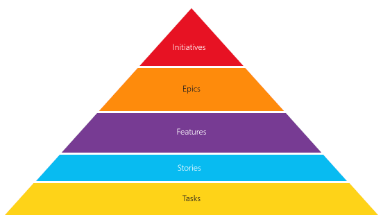
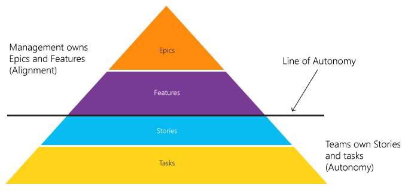
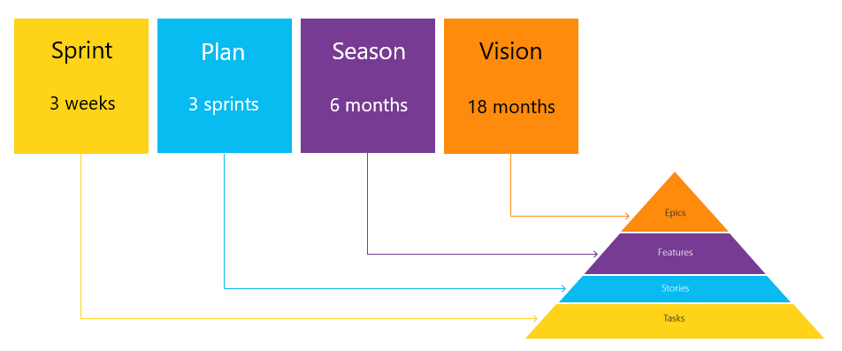

# Agile у великій організації

## Зміст

- [Чому компанії впроваджують Agile у великому масштабі](#чому-компанії-впроваджують-agile-у-великому-масштабі)
- [Що таке Agile у масштабі?](#що-таке-agile-у-масштабі)
- [7 ключових принципів для практики Agile у масштабі](#7-ключових-принципів-для-практики-agile-у-масштабі)
- [Баланс автономії та узгодженості](#баланс-автономії-та-узгодженості)
- [Визначення таксономії](#визначення-таксономії)
- [Лінія автономії](#лінія-автономії)
- [Планування](#планування)
- [Популярні фреймворки масштабування Agile](#популярні-фреймворки-масштабування-agile)
- [Різниця між фреймворками масштабування Agile](#різниця-між-фреймворками-масштабування-agile)
- [Висновок](#висновок)

## Чому компанії впроваджують Agile у великому масштабі

Сьогодні бізнесу потрібно швидко адаптуватися на рівні всієї організації, щоб залишатися конкурентоспроможним. Для цього важливо реагувати на нові потреби клієнтів, перевищувати їхні очікування, пропонувати гнучкі рішення, налагоджувати роботу багатьох команд і змінювати погляд на роль технологій як стратегічного чинника. Саме тому Agile-підходи дедалі частіше впроваджують не лише в ІТ чи розробці.

Однак без чіткого плану чи фреймворку масштабне впровадження Agile ускладнює прогнозування термінів, координацію команд і фокус на ключових цілях бізнесу. Це може знизити задоволеність клієнтів, прибутки й ринкову частку.

Тому компанії інвестують у розвиток Agile-практик, щоб закріпити успіх уже діючих підходів і залишатися конкурентними. Проте як саме впроваджувати Agile у великому масштабі та яким має бути результат — питання, що досі викликає суперечки.

---

## Що таке Agile у масштабі?

Agile у масштабі — це здатність застосовувати принципи та практики Agile на рівні команди та водночас поширювати ті самі сталі підходи та результати на інші рівні організації.

Масштабування Agile-фреймворків — це культурна трансформація, коли люди, практики й інструменти в компанії спрямовані на покращення співпраці та здатності організації реалізовувати свою стратегію.

Зрештою, зміни у цих сферах сприятимуть децентралізації ухвалення рішень, підвищенню прозорості та узгодженості роботи й пришвидшенню виходу на ринок, водночас закріплюючи цінності Agile у ДНК організації.

---

## 7 ключових принципів для практики Agile у масштабі

Хоча не існує універсального підходу до масштабування Agile, є сім принципів, без яких успіху досягти неможливо. Незалежно від того, чи використовуєте ви фреймворк чи окремі практики, розгляньте такі принципи як дороговкази для формалізації власної системи:

1. Чітко визначені ролі та зміни у структурі організації.
2. Орієнтація на клієнта та розвиток з урахуванням його потреб.
3. Agile/Scrum-практики та сталі ритми роботи.
4. Зрілість впровадження (поступова трансформація).
5. Поліпшення управління залежностями.
6. Підтримка змін знизу вгору та зверху вниз.
7. Орієнтація на людей, Lean-підходи та системне мислення.

---

## Баланс автономії та узгодженості

Відповідно до принципів Agile, автономні команди працюють продуктивніше. Організація, що впроваджує Agile, прагне надати командам контроль над повсякденним виконанням завдань. Однак автономія без узгодженості призводить до хаосу: десятки незалежних команд не створять єдиний, якісний продукт. Узгодженість забезпечує командам спільну мету та гарантує досягнення організаційних цілей. Без цього навіть найефективніші команди зазнають невдачі.

Щоб масштабувати Agile, необхідно поєднати автономію команд з узгодженням із цілями організації.

**Основні компоненти масштабування Agile**

Для підтримки балансу між автономією та узгодженістю лідерам DevOps слід:

- визначити таксономію,
- організувати процес планування,
- застосовувати **feature chats** (зустрічі з обговорення функціоналу).

---

## Визначення таксономії

Agile-команда та вся організація потребують чітко визначеного беклогу для досягнення успіху. Якщо організаційні цілі нечіткі, командам буде складно реалізувати їх на практиці.

Щоб сформувати зрозумілі цілі й описати внесок кожної команди, організації потрібно розробити **таксономію** — систему позначень і рівнів ієрархії.

Найпоширенішою таксономією є: **ініціативи**, **епіки**, **фічі**, **історії**, **задачі**.

### Типова структура таксономії

- **Epics**  
  Описують ключові ініціативи, важливі для успіху організації. Для виконання епіка часто потрібна робота кількох команд протягом кількох спринтів. Епік має чітку мету. Після досягнення мети епік закривають. Кількість активних епіків має бути керованою, щоб зберігати фокус організації. Епіки розбиваються на фічі.

- **Features**  
  Визначають нову функціональність, необхідну для реалізації цілей епіка. Фічі є одиницями випуску: вони описують, що саме отримує клієнт. Релізні примітки формують на основі списку нещодавно завершених фіч. Фічі можуть вимагати кількох спринтів, проте мають бути достатньо компактними, щоб забезпечувати постійний потік цінності для користувача. Фічі розбивають на історії.

- **Stories**  
  Визначають інкрементальну цінність, яку команда має надати для створення фічі. Команда розбиває фічу на окремі історії. Одна завершена історія може не мати самостійної цінності для користувача, проте вона завжди є якісним програмним продуктом. Історії — це робочі одиниці команди. Історії можна додатково розбивати на задачі.

- **Facts**  
  Описують конкретну роботу, необхідну для завершення історії.

- **Initiatives**  
  Деякі організації використовують рівень вище епіків — ініціативи.

---

## Лінія автономії

Після визначення таксономії організації потрібно провести **лінію автономії**. Це межа, яка визначає, на якому рівні управління передає право власності команді. Менеджмент не втручається в рівні, що належать команді.

### Приклад

Лінію автономії можна провести під рівнем фіч: менеджмент управляє епіками та фічами, забезпечуючи узгодженість. Команди ж володіють історіями й задачами та мають автономію у виконанні.

При цьому менеджмент не регламентує, як команда деталізує історії, планує спринти чи виконує роботу. Водночас команда повинна забезпечити, щоб їх виконання відповідало цілям менеджменту.

---

## Планування

Для масштабування планування Agile необхідно мати план для кожного рівня таксономії. При цьому планування має бути ітеративним і регулярно оновлюватися. Такий підхід називають **rolling wave planning** — хвильове планування.

План визначає напрямок на певний період із передбачуваною корекцією на регулярних етапах. Наприклад, план на 18 місяців коригують кожні шість місяців.

### Приклад планування для кожного рівня

- **Бачення (Vision)**  
  Бачення виражене через епіки й визначає довгостроковий курс організації. Епіки описують, що організація планує виконати протягом наступних 18 місяців. Менеджмент володіє цим планом і переглядає його кожні шість місяців. Очікується досягнення близько 60% бачення.

- **Сезон (Season)**  
  Сезон описують фічі та визначають стратегію на найближчі шість місяців. Фічі демонструють, які можливості організація планує надати клієнтам. Сезонним планом управляє менеджмент і презентує його разом із баченням на загальних зборах. Всі плани команд мають узгоджуватися з сезонним планом. Очікується реалізація близько 80% сезонного плану.

- **План на три спринти (3-sprint plan)**  
  Визначає історії та фічі, які команда завершить упродовж наступних трьох спринтів. Команда володіє планом і коригує його щоспринту. Кожна команда презентує план менеджменту під час **feature chat**. План демонструє, як виконання команди узгоджується із сезонним планом. Очікується реалізація близько 90% цього плану.

- **Спринт-план (Sprint plan)**  
  Визначає історії та фічі, які команда завершує в наступному спринті. Команда володіє спринт-планом і надсилає його всій організації для повної прозорості. План містить інформацію про досягнення попереднього спринту та фокус наступного. Очікується реалізація близько 95% спринт-плану.

## Популярні фреймворки масштабування Agile

Єдино правильного способу масштабувати Agile не існує. Однак багато організацій досягли успіху, розвиваючи свої процеси, команди та культуру завдяки використанню популярних фреймворків масштабування Agile.

### SAFe

**Scaled Agile Framework® (SAFe®)** — це набір організаційних та робочих шаблонів для впровадження Agile-практик у масштабі підприємства. Він ґрунтується на трьох основних напрямах знань: гнучка розробка ПЗ, lean-розробка продукту та системне мислення. SAFe сприяє узгодженості, співпраці та поставці між великою кількістю Agile-команд.

### LeSS

**Large-Scale Scrum (LeSS)** — це звичайний Scrum, застосований до великомасштабної розробки. LeSS ґрунтується на мінімалізмі: менше правил, ролей і артефактів — більше успіху. Однак LeSS та SAFe мають спільні риси: Scrum на рівні команди, спільний беклог для багатьох команд, колективне планування та принципи pull і самоорганізації, знайомі кожній невеликій Agile-команді.

### DA

**Disciplined Agile (DA)**, раніше відомий як Disciplined Agile Delivery (DAD), — це процесний фреймворк для доставки ІТ-рішень, орієнтований на навчання. Він забезпечує міцну основу для масштабування доставки Agile-рішень у великих організаціях. DA поєднує Scrum і Kanban та враховує знання з трансформації у таких сферах, як HR, фінанси, управління, DevOps, портфельне управління тощо. DA часто вважається більш гнучким та легким у масштабуванні.

### Spotify

Модель **Spotify** спочатку не задумувалась як фреймворк, проте підхід організації до Agile природно переріс у нього. Spotify-модель — це орієнтований на людей, автономний підхід до масштабування Agile. Він акцентує увагу на культурі й мережах і демонструє, як працювати з багатьма командами у продуктовій організації.

### Scrum@Scale (S@S)

**Scrum@Scale** — це розширення фреймворку Scrum. Зазвичай його впроваджують організації, які вже успішно реалізували Scrum на рівні окремих команд і прагнуть поширити його на весь бізнес. Основна мета — об’єднати зростаючі організації навколо спільних цілей. Координація відбувається через Scrum of Scrums (зі Scrum-майстрів кожної команди) та MetaScrum (зі власників продуктів).

---

## Різниця між фреймворками масштабування Agile

Масштабовані фреймворки Agile можуть додати зайвих процесів, якщо їх застосовувати бездумно. Але формалізація спільних ритуалів, ролей і принципів для масштабування Agile у вашій організації має очевидні переваги, особливо коли компанія тільки починає працювати за Agile-підходами.

Нижче наведено загальні сфери застосування кожного фреймворку:

| Напрямок                        | SAFe                     | LeSS & LeSS Huge           | Spotify Model            | Disciplined Agile (DA)   | Scrum@Scale             |
|---------------------------------|--------------------------|----------------------------|--------------------------|--------------------------|-------------------------|
| Довгострокове планування        | Так                      | Так                        | Так                      | Так                      | Так                     |
| Підтримка багатьох Agile-команд | Так                      | Так                        | Так                      | Так                      | Так                     |
| Організація команд команд       | ART (Agile Release Train)| Area (зона для команд)     | Tribes (племена)         | Немає окремого механізму | Scrum of Scrums         |
| Ролі PM/PO                      | Передбачені              | Передбачені                | Передбачені              | Передбачені              | Передбачені             |
| Scrum-майстер / Agile-коуч      | Передбачені              | Передбачені                | Передбачені              | Передбачені              | Передбачені             |
| Release Engineer / Group Manager| Передбачені              | Не передбачені             | Не передбачені           | Не передбачені           | Не передбачені          |
| Agile-практики (Scrum, Kanban)  | Так                      | Так                        | Так                      | Так                      | Так                     |
| Демонстрації                    | Так                      | Так                        | Так                      | Так                      | Так                     |
| Ретроспективи                   | Так                      | Так                        | Так                      | Так                      | Так                     |
| Орієнтація на клієнта / цінність| Так                      | Так                        | Так                      | Так                      | Так                     |
| Управління залежностями         | Так                      | Так                        | Так                      | Так                      | Так                     |
| Прозорість стратегії            | Так                      | Так                        | Так                      | Так                      | Так                     |
| Портфельне управління           | Так                      | Не передбачене             | Не передбачене           | Так                      | Не передбачене          |
| Гнучкі поставки за потреби      | Так                      | Так                        | Так                      | Так                      | Так                     |
| Управління ризиками             | Так                      | Не передбачене             | Не передбачене           | Так                      | Не передбачене          |
| DevOps-практики                 | Так                      | Не передбачені             | Так                      | Так                      | Не передбачені          |

---

## Висновок

Масштабування Agile потребує не лише методів і фреймворків, а й готовності компанії змінювати культуру, управлінські підходи та взаємодію команд. Вибір конкретного підходу залежить від розміру організації, структури команд і бізнес-цілей.
