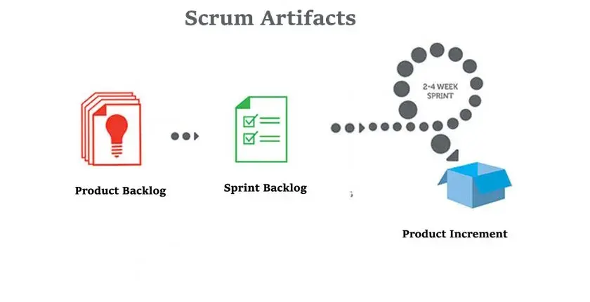
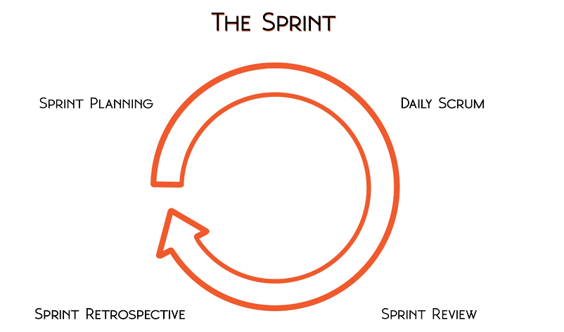
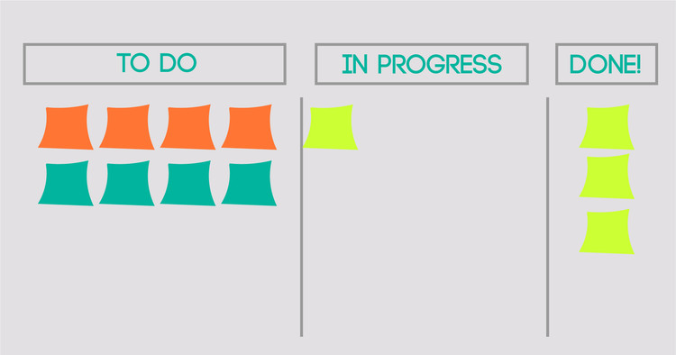
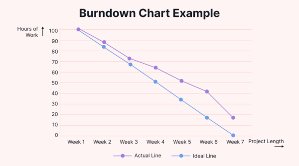
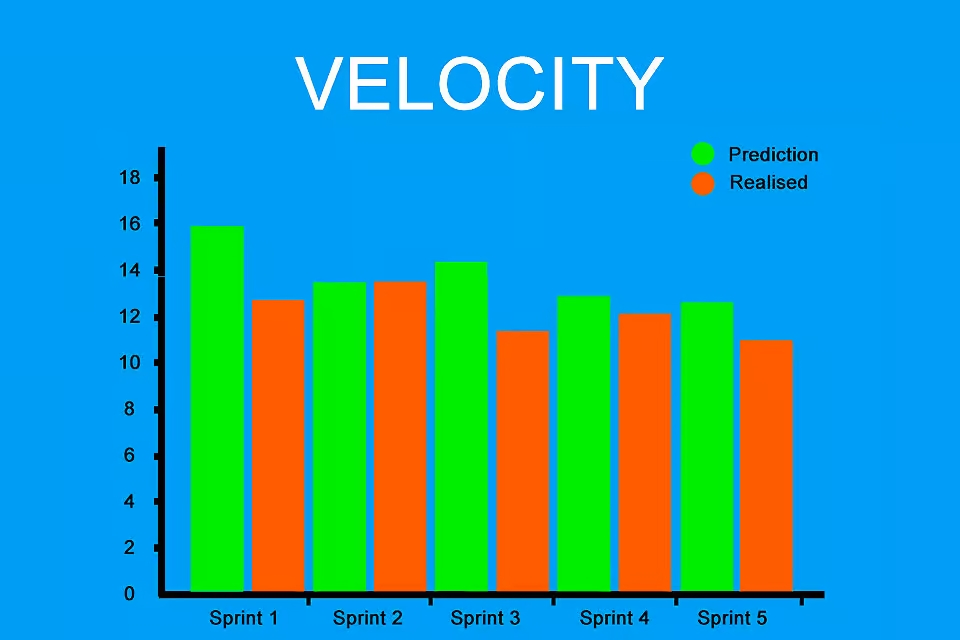

# Scrum

## Зміст

- [Що таке Scrum?](#що-таке-scrum)
- [Історія виникнення Scrum](#історія-виникнення-scrum)
- [Коли слід використовувати Scrum?](#коли-слід-використовувати-scrum)
- [Ролі у Scrum-команді](#ролі-у-scrum-команді)
- [Артефакти Scrum](#артефакти-scrum)
- [Події у Scrum (Scrum Events)](#події-у-scrum-scrum-events)
- [Scrum-дошка: візуалізація роботи](#scrum-дошка-візуалізація-роботи)
- [Definition of Done (DoD)](#definition-of-done-dod)
- [Burndown Chart та Velocity](#burndown-chart-та-velocity)
- [Кроки впровадження Scrum](#кроки-впровадження-scrum)
- [Переваги Scrum](#переваги-scrum)
- [Висновок](#висновок)

---

## Що таке Scrum?

Scrum — це гнучка методологія управління проєктами, яка широко застосовується в розробці програмного забезпечення та інших сферах для організації командної роботи над складними проєктами. Вона базується на ітеративному та інкрементальному підході, що дозволяє командам швидко адаптуватися до змін вимог і доставляти цінність клієнтам у короткі терміни. Назва "Scrum" походить від регбі, де термін означає тісне командне формування для швидкого просування м’яча, що символізує злагоджену співпрацю.

Основна ідея Scrum полягає в розбитті проєкту на короткі цикли, які називаються **спринтами**, тривалістю зазвичай від 1 до 4 тижнів. Кожен спринт завершується створенням працюючого продукту або його частини, готової до демонстрації чи використання. Scrum допомагає командам зосередитися на пріоритетних завданнях, мінімізувати хаос у процесі розробки та постійно вдосконалювати свої робочі процеси.

Методологія спирається на три ключові принципи:
- **Прозорість**: Усі члени команди та зацікавлені сторони мають доступ до інформації про прогрес і стан проєкту.
- **Інспекція**: Регулярна оцінка результатів і процесів для виявлення проблем і можливостей для покращення.
- **Адаптація**: Гнучке реагування на зміни вимог, зворотний зв’язок або нові виклики.

Scrum використовує чітко визначені ролі, артефакти та події, які допомагають командам працювати ефективно. Ця методологія підходить для проєктів, де вимоги можуть змінюватися, а результат потрібно доставляти частинами, забезпечуючи швидке отримання цінності для бізнесу.

## Історія виникнення Scrum

Scrum бере свій початок у 1986 році, коли японські інженери Хіротака Такеучі та Ікудзіро Нонака опублікували статтю в *Harvard Business Review*, де описали гнучкий підхід до розробки продуктів, натхненний командною роботою в регбі. Вони запропонували модель, яка об’єднує крос-функціональні команди для швидкого створення інноваційних продуктів, що стало прообразом сучасного Scrum.

У 1990-х роках цей підхід адаптували для програмної інженерії. У 1993 році Джефф Сазерленд, разом із Джоном Скрамблом і Джефом Маккеною, почав експериментувати з ідеями Такеучі та Нонаки в компанії Easel Corporation, створивши першу версію Scrum. У 1995 році Сазерленд і Кен Швабер офіційно представили Scrum на конференції OOPSLA, опублікувавши "Scrum Development Process". Ця подія заклала основу для методології, яка згодом стала частиною Agile Manifesto 2001 року.

З того часу Scrum еволюціонував завдяки спільноті практиків, а його принципи були формалізовані в "Scrum Guide" — посібнику, який Сазерленд і Швабер регулярно оновлюють. Сьогодні Scrum є однією з найпопулярніших гнучких методологій, застосовуваною не лише в ІТ, а й у маркетингу, освіті та інших сферах.

## Коли слід використовувати Scrum?

Scrum найкраще підходить для проєктів, де потрібна гнучкість, швидка адаптація до змін і регулярна доставка цінності. Ось випадки, коли варто застосовувати Scrum:

- **Динамічні вимоги**: Коли вимоги до продукту часто змінюються, а команда має швидко реагувати на нові пріоритети.
- **Командна співпраця**: Для крос-функціональних команд, які можуть самостійно планувати та виконувати завдання.
- **Ітеративний розвиток**: Коли продукт потрібно розробляти частинами з можливістю тестування та зворотного зв’язку після кожного етапу.
- **Короткі цикли доставки**: Для проєктів, де важлива регулярна демонстрація результатів (наприклад, кожні 1-4 тижні).
- **Висока невизначеність**: У ситуаціях, коли початкові деталі проєкту нечіткі, але є можливість уточнювати їх поступово.

### Коли Scrum може не підходити:
- **Жорсткі дедлайни**: Якщо проєкт має фіксовані терміни без можливості адаптації.
- **Мала команда**: Для команд менш як 3-5 осіб Scrum може бути надмірним через складність ролей і подій.
- **Повна залежність від зовнішніх факторів**: Якщо прогрес блокується зовнішніми стейкхолдерами або ресурсами.
- **Лінійні процеси**: Для проєктів із чіткою послідовністю етапів (наприклад, будівництво), де ітеративність менш ефективна.

Scrum ефективний у сферах, таких як розробка програмного забезпечення, створення продуктів, маркетингові кампанії, де важливо швидко отримувати зворотний зв’язок і вдосконалювати продукт.

## Ролі у Scrum-команді

Scrum-команда є основною одиницею в методології Scrum, яка функціонує на принципах **самоорганізації**, **крос-функціональності** та **співпраці**. Вона складається з трьох ключових ролей: **Product Owner**, **Scrum Master** і **Development Team**. Кожна з цих ролей має унікальні обов’язки та відповідальності, які разом забезпечують ефективне управління проєктом, **доставку цінності** клієнтам і безперервне **покращення** процесів у межах **Agile Framework**. Нижче наведено детальний опис кожної ролі, а також їхня взаємодія, що робить Scrum потужним інструментом для **управління проєктами** та **розробки програмного забезпечення**.

- **Product Owner (Власник продукту)**:
  
  **Основна відповідальність**: Максимізація цінності продукту шляхом ефективного управління **Product Backlog** — списком усіх завдань, вимог і функцій, які потрібно реалізувати.

  **Обов’язки**:
    - Визначає пріоритети завдань на основі бізнес-цілей, зворотного зв’язку від стейкхолдерів і потреб ринку.
    - Чітко формулює вимоги до продукту, створюючи зрозумілі описи для команди (наприклад, через юзер-сторі).
    - Співпрацює зі стейкхолдерами (клієнтами, менеджерами, користувачами), щоб зібрати відгуки та адаптувати бачення продукту.
    - Забезпечує, щоб команда фокусується на найважливіших елементах, уникаючи непотрібної роботи.
  - **Роль у команді**: Активний комунікатор між бізнесом і технічною командою, який виступає єдиним джерелом правди щодо вимог до продукту.
- **Scrum Master**:
  
  **Основна відповідальність**: Сприяння дотриманню принципів Scrum, виступаючи наставником, фасилітатором і захисником команди.

  **Обов’язки**:
    - Допомагає команді подолати **імпедименти** (перешкоди), такі як технічні проблеми, брак ресурсів або організаційні бар’єри.
    - Підтримує **самоуправління** команди, уникаючи мікрокерування, і сприяє створенню середовища, де команда може приймати власні рішення.
    - Забезпечує, щоб усі учасники команди дотримувалися Scrum-процесів, таких як спринти, планування та ретроспективи.
    - Проводить тренінги та коучинг, щоб покращити знання команди про методологію та підвищити її **ефективність**.
  - **Роль у команді**: Лідер-сервіс, який фокусується на усуненні перешкод і створенні умов для продуктивної роботи, а не на прямому управлінні.

- **Development Team (Розробницька команда)**:
  
  **Основна відповідальність**: Пряме виконання роботи над **інкрементом** продукту — функціональною частиною, готовою до використання або демонстрації.

  **Обов’язки**:
    - Самоорганізовується для планування, розробки, тестування та інтеграції завдань, узгоджених у **Sprint Backlog**.
    - Складається з 3-9 осіб із різними навичками (розробники, тестувальники, дизайнери), щоб охопити всі аспекти створення продукту.
    - Забезпечує, що кожен інкремент відповідає критеріям **Definition of Done** (Готовність), гарантуючи високу якість.
    - Активно бере участь у щоденних стендапаах, плануванні спринтів і ретроспективах для координації зусиль.
  - **Роль у команді**: Серцевина процесу, яка перетворює ідеї в робочий продукт, спираючись на свою **крос-функціональність** і **ітеративний підхід**.

### Взаємодія ролей
Ці три ролі тісно пов’язані й доповнюють одна одну:
- **Product Owner** визначає, що потрібно зробити, задаючи напрямок через Product Backlog.
- **Scrum Master** забезпечує, щоб команда могла це реалізувати, усуваючи перешкоди та підтримуючи процес.
- **Development Team** виконує роботу, створюючи інкременти та доставляючи результат.

Така структура сприяє **координації**, **оптимізації** робочого процесу та підвищенню **ефективності** у **ітеративному плануванні**. Співпраця між ролями дозволяє швидко реагувати на зміни, вирішувати проблеми та вдосконалювати продукт у межах **Agile Methodology**.
## Артефакти Scrum

Артефакти Scrum — це ключові елементи, які допомагають команді планувати, відстежувати та доставляти цінність у межах методології. Вони забезпечують прозорість і структуру в роботі. 

До ключових артефактів Scrum належать три основні елементи, які забезпечують прозорість, контроль і постійне вдосконалення під час реалізації проєкту:

- **Product Backlog (Беклог продукту)**  
  Це впорядкований список усіх функціональних і нефункціональних вимог до продукту — завдань, ідей, поліпшень і виправлень, які необхідно реалізувати. Власник продукту (Product Owner) постійно підтримує його актуальність, оновлюючи на основі зворотного зв’язку, змін ринку чи нових бізнес-цілей. Беклог є живим документом, який змінюється разом із продуктом.

- **Sprint Backlog (Беклог спринту)**  
  Це підмножина беклогу продукту, яку команда відбирає на конкретний спринт. Вона включає завдання, що команда зобов’язується реалізувати, а також план, як цього досягти. Sprint Backlog надає чітке уявлення про те, над чим команда працює протягом поточного ітераційного циклу.

- **Increment (Інкремент)**  
  Це сукупність завершених елементів продукту, які були реалізовані протягом спринту. Інкремент має бути повністю готовим до демонстрації або випуску, відповідаючи встановленим критеріям **Definition of Done**. Кожен новий інкремент доповнює попередні, наближаючи продукт до кінцевої цілі.

Також у практиці Scrum можуть використовуватися й інші артефакти, які, хоч і не є основними за визначенням методології, значно полегшують роботу команд. Наприклад, Burndown Chart допомагає відстежувати залишкову роботу протягом спринту, а Velocity Chart дозволяє оцінити продуктивність для планування майбутніх ітерацій. Такі інструменти, як Definition of Done у вигляді окремого документа чи Task Board, сприяють прозорості та координації, адаптуючись до потреб конкретного проєкту. Хоча вони не входять до офіційних артефактів Scrum, їхнє застосування дозволяє командам оптимізувати процеси та підвищувати ефективність у реальних умовах розробки.

Ці артефакти є основою для координації зусиль команди та забезпечення інкрементального прогресу. На зображенні нижче показано, як вони взаємодіють протягом спринту.

## Події у Scrum (Scrum Events)

Scrum визначає набір регулярних подій, які забезпечують ритм, прозорість і постійне вдосконалення в роботі команди. Ці події допомагають команді залишатися скоординованою, своєчасно адаптувати плани та зосереджуватися на досягненні цілей спринту.

### У Scrum визначено п’ять основних подій (events), які створюють чітку структуру роботи:

### 1. **Sprint (Спринт)**  
Основна одиниця роботи в Scrum. Це фіксований період (зазвичай від 1 до 4 тижнів), протягом якого команда створює інкремент продукту. Усі інші події Scrum відбуваються всередині спринту. Спринт починається одразу після завершення попереднього.

### 2. **Sprint Planning (Планування спринту)**  
Подія на початку кожного спринту, під час якої команда визначає, яку роботу потрібно виконати та як вона буде реалізована.  
**Ключові питання**:
- Що ми можемо доставити в цьому спринті?
- Як ми будемо це реалізовувати?

### 3. **Daily Scrum (Щоденний Scrum)**  
Щоденна зустріч тривалістю до 15 хвилин, на якій команда синхронізує свої дії, обговорює прогрес і виявляє перешкоди.  
**Типові питання для кожного учасника**:
- Що я зробив учора?
- Що я планую зробити сьогодні?
- Чи є щось, що заважає моїй роботі?

### 4. **Sprint Review (Огляд спринту)**  
Проводиться наприкінці спринту для демонстрації виконаної роботи. Команда представляє інкремент зацікавленим сторонам, отримує зворотний зв’язок і обговорює подальші кроки розвитку продукту.

### 5. **Sprint Retrospective (Ретроспектива спринту)**  
Завершальна подія спринту, на якій команда аналізує свою роботу, процеси та взаємодію, щоб виявити можливості для покращення.  
**Мета** — підвищити ефективність і якість командної роботи в майбутніх спринтах.

---

Ці події допомагають підтримувати ритм роботи, фокусуватися на цілях та забезпечувати постійне вдосконалення команди і продукту.

---

## Scrum-дошка: візуалізація роботи

Scrum-дошка — це інструмент візуалізації завдань, який допомагає команді стежити за прогресом під час спринту. Вона слугує прозорим засобом комунікації між учасниками команди та дає змогу легко побачити, на якому етапі перебуває кожне завдання.

Зазвичай Scrum-дошка поділяється на кілька колонок, які відображають статус завдань:

- **To Do (Заплановано)** – завдання, обрані для спринту, але ще не розпочаті.
- **In Progress (У роботі)** – завдання, над якими активно працюють.
- **Done (Виконано)** – завершені завдання, які відповідають Definition of Done.

Також можливі додаткові колонки, наприклад: *Code Review*, *Testing*, *Blocked* — залежно від складності процесу команди.

### Формати Scrum-дошок:
- **Фізична дошка**: використовується в офісі з наліпками (стікерами) або картками.
- **Цифрові дошки**: інтерактивні інструменти, такі як Trello, Jira, Azure DevOps, ClickUp, які дозволяють працювати з дошкою онлайн, особливо зручно для віддалених команд.

### Навіщо потрібна Scrum-дошка:
- Візуально відображає навантаження та прогрес.
- Допомагає виявити "вузькі місця" (наприклад, скупчення завдань у певному статусі).
- Підвищує прозорість і відповідальність у команді.
- Полегшує підготовку до щоденних зустрічей (Daily Scrum).

Scrum-дошка — це не просто трекер завдань, а важливий артефакт команди, що сприяє прозорості, узгодженості та ефективній взаємодії всіх учасників процесу.

---

## Definition of Done (DoD)

**Definition of Done (DoD)** — це чіткий перелік критеріїв, які завдання або інкремент повинні задовольнити, щоб вважатися повністю завершеними. Це спільне розуміння між членами команди щодо того, що означає "готово".

DoD забезпечує прозорість, послідовність і якість результатів. Завдяки цьому всі члени команди знають, що очікується на виході, і не виникає непорозумінь щодо ступеня готовності завдання.

### Навіщо потрібен Definition of Done:
- Забезпечує **єдині стандарти якості** для всіх завдань.
- Мінімізує **ризик технічного боргу**.
- Полегшує приймання роботи на **Sprint Review**.
- Допомагає уникнути **неповністю виконаних** або «сирих» функцій.

### Приклади можливих пунктів DoD:
- Код написано, перевірено й інтегровано в основну гілку.
- Пройдено unit-тестування з 100% покриттям.
- Функціональність протестовано вручну.
- Документація оновлена.
- Пройшов Code Review і схвалений.
- Відсутні критичні баги.

> **Важливо**: Definition of Done створюється й погоджується всією командою на початку роботи та може доповнюватися в процесі. DoD використовується як контрольний список, за яким визначається, чи справді завдання "готове" — не лише написано, а й **готове до релізу**.

Таким чином, DoD — це інструмент, що допомагає команді зберігати високу якість, узгодженість і передбачуваність результатів у кожному спринті.

---
## Burndown Chart та Velocity

### Burndown Chart

Burndown Chart — це візуальний інструмент, який показує, як швидко команда виконує роботу протягом спринту або всього проєкту. Графік відображає залишковий обсяг роботи, зазвичай у вигляді сторі-пойнтів або годин, по вертикальній осі, а час (дні спринту або тижні проєкту) — по горизонтальній.

- **Основна мета:** допомогти команді та стейкхолдерам бачити поточний прогрес і зрозуміти, чи вкладаються вони у заплановані терміни.
- **Ідеальна лінія:** у графіку часто показується «ідеальна» лінія, що відображає рівномірне зменшення роботи до нуля на кінець спринту.
- **Фактична лінія:** ця лінія відображає реальний прогрес команди, і її відхилення від ідеальної допомагає визначити ризики та необхідність коригувань.
- **Переваги:** дозволяє швидко виявити, чи є затримки, чи команда працює ефективно, і дає змогу приймати обґрунтовані рішення щодо перенесення завдань або коригування обсягів роботи.

Burndown Chart використовується як на рівні спринту (Sprint Burndown), так і для всього продукту (Release Burndown), що дає змогу оцінити як короткостроковий, так і довгостроковий прогрес.

---

### Velocity

Velocity — це метрика продуктивності Scrum-команди, що показує обсяг роботи, який команда успішно завершила за один спринт. Зазвичай вимірюється у сторі-пойнтах, що відображають складність або обсяг завдань.

- **Визначення:** підсумок оцінок усіх завершених елементів Sprint Backlog, які відповідають Definition of Done.
- **Використання:** допомагає планувати майбутні спринти, прогнозуючи, скільки роботи команда може взяти на себе.
- **Стабільність:** із часом velocity стає стабільною метрикою, що полегшує прийняття рішень і підвищує точність планування.
- **Обмеження:** не можна порівнювати velocity між різними командами, оскільки оцінки можуть відрізнятися за методологією.

---

### Взаємодія Burndown Chart та Velocity

Ці два інструменти взаємодоповнюють один одного:

- Burndown Chart відображає поточний темп виконання роботи в спринті, показуючи, чи команда рухається за планом.
- Velocity дає довгострокове уявлення про продуктивність і допомагає адаптувати планування на основі попередніх результатів.

Використання цих метрик допомагає Scrum-команді підтримувати прозорість, швидко реагувати на проблеми та постійно покращувати процес розробки.

---

## Кроки впровадження Scrum

Впровадження Scrum в команду або організацію — це не просто зміна процесів, а трансформація способу мислення, управління та співпраці. Щоб перехід був успішним, слід пройти низку ключових кроків:

### 1. Ознайомлення з основами Scrum
Перш за все, команда та менеджмент мають вивчити принципи, ролі, артефакти та події Scrum. Рекомендується:
- Прочитати **Scrum Guide**.
- Провести тренінги або воркшопи для працівників.
- Визначити, чи підходить Scrum для поточних проєктів.

### 2. Формування Scrum-команди
Створити команду з необхідними ролями:
- **Product Owner** — відповідає за цінність продукту.
- **Scrum Master** — захищає процес, допомагає команді дотримуватися Scrum.
- **Development Team** — крос-функціональна команда, що виконує завдання.

### 3. Налаштування артефактів
Потрібно створити базові Scrum-артефакти:
- **Product Backlog** — сформувати список вимог і початкових функцій.
- **Definition of Done** — узгодити критерії завершення завдань.
- Визначити інструменти для ведення backlog'у (Jira, Trello, Notion тощо).

### 4. Запуск першого спринту
- Провести **Sprint Planning** для визначення цілей спринту.
- Розпочати **спринт** тривалістю 1–4 тижні.
- Впровадити **Daily Scrum** для щоденної синхронізації.

### 5. Регулярний аналіз та вдосконалення
- Після завершення спринту провести **Sprint Review** для демонстрації результатів.
- Провести **Sprint Retrospective**, щоб виявити проблеми та шляхи покращення.
- Коригувати процеси та backlog згідно з отриманим зворотним зв’язком.

---

Успішне впровадження Scrum потребує терпіння, підтримки керівництва та відкритості до змін. Команда має постійно вдосконалюватися, аналізуючи досвід і шукаючи оптимальні підходи для досягнення результату.

---

## Переваги Scrum

Scrum надає численні переваги як для команд розробників, так і для бізнесу загалом. Завдяки гнучкості, прозорості та швидкому зворотному зв’язку Scrum допомагає створювати продукти більш ефективно, адаптуючись до змін на кожному етапі.

### Гнучкість і адаптивність
- Scrum дозволяє швидко реагувати на зміни вимог, пріоритетів і умов ринку. Команда може адаптувати свій план під час кожного спринту, не втрачаючи фокусу.

### Швидке отримання цінності
- Завдяки коротким спринтам продукт або його частини доставляються регулярно. Це дозволяє бізнесу отримувати цінність вже на ранніх етапах проєкту.

### Прозорість процесу
- Регулярні події (Daily Scrum, Sprint Review, Retrospective) забезпечують постійне інформування команди та зацікавлених сторін про стан проєкту.

### Безперервне покращення
- Після кожного спринту команда аналізує свої дії та процеси, шукаючи шляхи для вдосконалення. Це сприяє росту продуктивності та командного духу.

### Підвищена відповідальність команди
- Scrum-команди є самоорганізованими. Це сприяє більшій залученості, автономності та відповідальності кожного учасника за загальний результат.

### Краще планування та оцінювання
- Завдяки використанню velocity та аналізу попередніх спринтів, команда здатна точніше планувати обсяг майбутньої роботи.

---

## Висновок

Scrum є ефективною гнучкою методологією управління проєктами, що допомагає командам організувати роботу у короткі ітерації, швидко адаптуватися до змін та регулярно доставляти цінність клієнтам. Чітко визначені ролі, артефакти та події створюють структуру, яка підтримує прозорість, співпрацю та безперервне покращення.

Впровадження Scrum сприяє підвищенню продуктивності команд, якості продукту та задоволеності замовників. Методологія особливо корисна в умовах невизначеності та швидкозмінних вимог, що робить її популярним вибором не лише у розробці програмного забезпечення, а й у багатьох інших сферах.

Загалом, Scrum допомагає організаціям створювати адаптивні, гнучкі процеси, які дозволяють ефективно реагувати на виклики сучасного ринку та підтримувати конкурентоспроможність.

