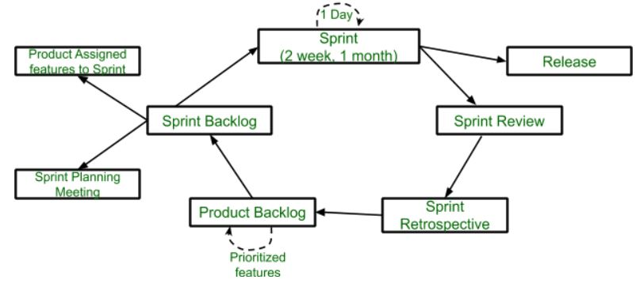

# Scrum

## Зміст

- [Що таке Scrum у розробці програмного забезпечення?](#що-таке-scrum-у-розробці-програмного-забезпечення)
- [Основні особливості Scrum](#основні-особливості-scrum)
- [Переваги Scrum-фреймворку](#переваги-scrum-фреймворку)
- [Недоліки Scrum-фреймворку](#недоліки-scrum-фреймворку)
- [Висновок](#висновок)

---

## Що таке Scrum у розробці програмного забезпечення?

**Scrum** — це популярний фреймворк, який використовується для розробки складних продуктів. Його розробили Кен Швабер і Джефф Сазерленд. Scrum належить до Agile-фреймворків.

Scrum — це управлінський фреймворк, який дозволяє командам самоорганізовуватися, виконувати завдання та працювати над досягненням спільної мети. Він допомагає вирішувати складні адаптивні задачі, одночасно підтримуючи високу продуктивність і креативність для створення цінного продукту.

Ітеративний і інкрементальний підхід у Scrum дозволяє командам швидко адаптуватися до змін у вимогах.

---

## Основні особливості Scrum

- Scrum — легковаговий фреймворк.
- Наголос робиться на самоорганізацію команди.
- Простий для розуміння.
- Допомагає команді працювати разом ефективно.

**Життєвий цикл Scrum:**

- **Sprint** — це часовий проміжок тривалістю до одного місяця. Новий спринт починається одразу після завершення попереднього.
- **Release** — коли продукт завершено, він переходить до стадії випуску.
- **Sprint Review** — якщо у продукті є нереалізовані функції, вони перевіряються на цьому етапі та передаються до Retrospective.
- **Sprint Retrospective** — перевіряється якість або стан продукту.
- **Product Backlog** — список усіх функцій, які пріоритезуються та організовуються.
- **Sprint Backlog** — ділиться на дві частини: функції, призначені для спринту, і спринт-планувальна зустріч.

---

## Переваги Scrum-фреймворку

- Швидкість і економія ресурсів.
- Поділ великого продукту на менші підпродукти (стратегія «розділяй і володарюй»).
- Високий рівень задоволеності клієнтів.
- Адаптивність завдяки коротким спринтам.
- Постійний зворотний зв'язок покращує якість продукту за короткий час.

---

## Недоліки Scrum-фреймворку

- Не допускаються зміни у спринті після його початку.
- Scrum — це не повністю описана модель, потребує доповнень (наприклад, XP, Kanban, DSDM).
- Важко планувати проєкти без чітких вимог.
- Щоденні зустрічі та часті огляди потребують значних ресурсів.

---

## Висновок

Отже, Scrum — це Agile-фреймворк для розробки продуктів, який покращує самоорганізацію та можливості команди. Він підвищує продуктивність і задоволеність клієнтів, але може викликати труднощі з внесенням змін посеред спринту та потребує додаткових рішень для впровадження.
